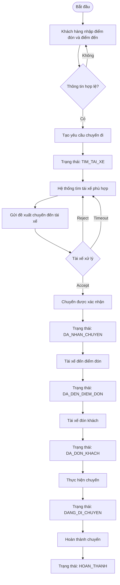
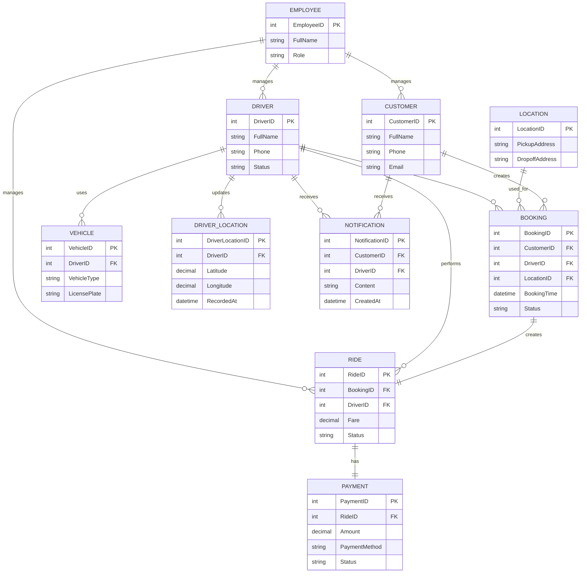

# . BÊN LIÊN QUAN HỆ THỐNG (STAKEHOLDERS)

| Stakeholder                             | Vai trò                                                                                                       |
| --------------------------------------- | ------------------------------------------------------------------------------------------------------------- |
| **Khách hàng (Customer)**               | Người sử dụng dịch vụ, tạo yêu cầu đặt xe, theo dõi chuyến đi, thực hiện thanh toán và xem lịch sử chuyến đi. |
| **Tài xế (Driver)**                     | Cung cấp dịch vụ vận chuyển, nhận hoặc từ chối chuyến, cập nhật trạng thái chuyến và cung cấp vị trí GPS.     |
| **Nhân viên vận hành (Admin/Operator)** | Quản lý khách hàng, tài xế, chuyến đi, hỗ trợ xử lý sự cố và theo dõi hoạt động của hệ thống.                 |
| **Ban Giám Đốc**                        | Sponsor dự án, định hướng phát triển hệ thống, theo dõi tiến độ triển khai và hiệu quả hoạt động kinh doanh.  |
| **Bộ phận Kế toán**                     | Theo dõi doanh thu, quản lý và đối soát các giao dịch thanh toán.                                             |

---

# . CHUYỂN ĐỔI YÊU CẦU KHÁCH HÀNG THÀNH MỤC TIÊU NGHIỆP VỤ

Dựa trên các yêu cầu của khách hàng, hệ thống CAB được chuyển đổi thành các mục tiêu nghiệp vụ (Business Goals). Mỗi mục tiêu được định danh bằng mã **BG** nhằm thuận tiện cho việc quản lý, theo dõi và liên kết với các chức năng của hệ thống.

| Mã BG     | Mục tiêu nghiệp vụ                                                                                                                      |
| --------- | --------------------------------------------------------------------------------------------------------------------------------------- |
| **BG-01** | Cho phép khách hàng tạo yêu cầu chuyến đi bằng cách nhập điểm đón và điểm đến hợp lệ.                                                   |
| **BG-02** | Cho phép khách hàng lựa chọn và xác nhận tài xế được hệ thống đề xuất cho chuyến đi.                                                    |
| **BG-03** | Tự động tìm kiếm và đề xuất tài xế phù hợp dựa trên trạng thái hoạt động, vị trí GPS và khu vực điểm đón.                               |
| **BG-04** | Cho phép tài xế nhận hoặc từ chối chuyến trong thời gian quy định và tự động tìm tài xế khác khi từ chối hoặc hết thời gian chờ.        |
| **BG-05** | Cho phép khách hàng theo dõi trạng thái chuyến đi và vị trí tài xế theo thời gian thực.                                                 |
| **BG-06** | Cho phép tài xế cập nhật trạng thái chuyến đi trong suốt quá trình thực hiện chuyến.                                                    |
| **BG-07** | Tự động xác định số tiền khách hàng cần thanh toán và tạo thông tin thanh toán cho chuyến đi.                                           |
| **BG-08** | Cho phép khách hàng thực hiện thanh toán và quản lý trạng thái giao dịch.                                                               |
| **BG-09** | Cho phép khách hàng xem lại lịch sử chuyến đi và thông tin thanh toán liên quan.                                                        |
| **BG-10** | Hỗ trợ nhân viên vận hành quản lý khách hàng, tài xế, chuyến đi và xử lý các sự cố trong quá trình vận hành.                            |
| **BG-11** | Cung cấp các báo cáo cơ bản về chuyến đi, doanh thu, khách hàng và tài xế để hỗ trợ quản lý.                                            |
| **BG-12** | Đảm bảo hoạt động đặt xe và các chức năng chính của hệ thống vẫn được duy trì khi dịch vụ thanh toán hoặc thông báo gặp sự cố tạm thời. |

---

# . PHẠM VI MODULE HỆ THỐNG (SYSTEM MODULES)

Để đảm bảo dự án CAB System có thể hoàn thành trong thời gian 7 tuần, hệ thống được giới hạn trong 5 module chính.

##  Module 1 - Quản lý Khách hàng (Customer Management)

**Mục đích:**
Quản lý tài khoản và thông tin cơ bản của khách hàng, phục vụ quá trình đặt xe và sử dụng dịch vụ.

**Business Goal:** BG-02, BG-04

| STT | Chức năng MVP                |
| --: | ---------------------------- |
|   1 | Đăng ký tài khoản            |
|   2 | Đăng nhập / đăng xuất        |
|   3 | Xem thông tin cá nhân        |
|   4 | Cập nhật thông tin cá nhân   |
|   5 | Quản lý trạng thái tài khoản |
|   6 | Xem lịch sử chuyến đi        |

##  Module 2 - Quản lý Tài xế (Driver Management)

**Mục đích:**
Quản lý thông tin tài xế và trạng thái hoạt động, làm cơ sở cho việc tự động ghép tài xế với khách hàng.

**Business Goal:** BG-01, BG-04, BG-05

| STT | Chức năng MVP                        |
| --: | ------------------------------------ |
|   1 | Đăng nhập tài khoản tài xế           |
|   2 | Xem / cập nhật thông tin tài xế      |
|   3 | Cập nhật trạng thái Online / Offline |
|   4 | Cập nhật trạng thái Available / Busy |
|   5 | Cập nhật vị trí GPS                  |
|   6 | Nhận đề xuất chuyến                  |
|   7 | Chấp nhận chuyến                     |
|   8 | Từ chối chuyến                       |
|   9 | Xem lịch sử chuyến                   |

## . Module 3 - Đặt xe & Ghép tài xế (Booking & Matching)

**Mục đích:**
Là module nghiệp vụ cốt lõi của CAB System, chịu trách nhiệm tiếp nhận yêu cầu đặt xe và tự động tìm tài xế phù hợp.

**Business Goal:** BG-01, BG-02, BG-05

| STT | Chức năng MVP                    |
| --: | -------------------------------- |
|   1 | Nhập điểm đón                    |
|   2 | Nhập điểm đến                    |
|   3 | Tạo yêu cầu đặt xe               |
|   4 | Tính giá dự kiến                 |
|   5 | Tìm tài xế phù hợp               |
|   6 | Gửi đề xuất chuyến cho tài xế    |
|   7 | Xử lý tài xế chấp nhận / từ chối |
|   8 | Xử lý Timeout                    |
|   9 | Retry tìm tài xế                 |
|  10 | Xác nhận tài xế                  |
|  11 | Hủy chuyến                       |
|  12 | Quản lý trạng thái chuyến        |

### Trạng thái chuyến

| STT | Trạng thái          |
| --: | ------------------- |
|   1 | KHOI_TAO            |
|   2 | TIM_TAI_XE          |
|   3 | CHO_TAI_XE_XAC_NHAN |
|   4 | DA_NHAN_CHUYEN      |
|   5 | DA_DEN_DIEM_DON     |
|   6 | DA_DON_KHACH        |
|   7 | DANG_DI_CHUYEN      |
|   8 | HOAN_THANH          |
|   9 | HUY_CHUYEN          |

## . Module 4 - Theo dõi Chuyến & Thanh toán (Ride Tracking & Payment)

**Mục đích:**
Quản lý quá trình thực hiện chuyến đi, cập nhật vị trí tài xế và xử lý thanh toán sau khi chuyến hoàn thành.

**Business Goal:** BG-02, BG-03, BG-05

| Nhóm            | STT | Chức năng MVP                         |
| --------------- | --: | ------------------------------------- |
| Theo dõi chuyến |   1 | Theo dõi chuyến                       |
| Theo dõi chuyến |   2 | Cập nhật vị trí GPS tài xế            |
| Theo dõi chuyến |   3 | Hiển thị vị trí tài xế cho khách hàng |
| Theo dõi chuyến |   4 | Cập nhật trạng thái chuyến            |
| Theo dõi chuyến |   5 | Tài xế xác nhận đã đến điểm đón       |
| Theo dõi chuyến |   6 | Tài xế xác nhận đã đón khách          |
| Theo dõi chuyến |   7 | Tài xế bắt đầu chuyến                 |
| Theo dõi chuyến |   8 | Tài xế hoàn thành chuyến              |
| Thanh toán      |   9 | Tính cước chuyến                      |
| Thanh toán      |  10 | Chọn phương thức thanh toán           |
| Thanh toán      |  11 | Tạo giao dịch                         |
| Thanh toán      |  12 | Gửi giao dịch đến Payment Provider    |
| Thanh toán      |  13 | Nhận kết quả thanh toán               |
| Thanh toán      |  14 | Lưu trạng thái giao dịch              |
| Thanh toán      |  15 | Xử lý thanh toán thất bại             |

##  Module 5 - Quản trị & Vận hành (Admin & Operation)

**Mục đích:**
Cung cấp công cụ cho nhân viên vận hành quản lý khách hàng, tài xế và giám sát chuyến đi.

**Business Goal:** BG-03, BG-04, BG-05

| STT | Chức năng MVP                              |
| --: | ------------------------------------------ |
|   1 | Đăng nhập Admin / Operator                 |
|   2 | Quản lý khách hàng                         |
|   3 | Quản lý tài xế                             |
|   4 | Xem trạng thái Online / Offline của tài xế |
|   5 | Xem danh sách chuyến đi                    |
|   6 | Xem chi tiết chuyến đi                     |
|   7 | Theo dõi chuyến đang hoạt động             |
|   8 | Hỗ trợ xử lý chuyến lỗi                    |
|   9 | Xem giao dịch thanh toán                   |
|  10 | Xem báo cáo cơ bản                         |

## 4.6. Tổng quan phạm vi Module

| Module              | Vai trò chính         |
| ------------------- | --------------------- |
| Customer Management | Quản lý khách hàng    |
| Driver Management   | Quản lý tài xế        |
| Booking & Matching  | Đặt xe và ghép tài xế |
| Ride Tracking       | Theo dõi chuyến       |
| Payment             | Thanh toán            |
| Admin & Operation   | Quản trị và vận hành  |

**Giới hạn MVP:**
Không triển khai các chức năng nâng cao như Loyalty, Voucher nâng cao, Carpooling, Dynamic Pricing phức tạp, AI/ML, BI nâng cao và quản lý tài chính chuyên sâu.

---

#  BUSINESS REQUIREMENTS (BR)

Phần này mô tả các yêu cầu nghiệp vụ mà hệ thống CAB System phải đáp ứng để hỗ trợ quy trình đặt xe, quản lý tài xế, theo dõi chuyến đi, thanh toán và vận hành hệ thống.

## 5.1. Danh sách Business Requirements

| Mã    | Business Requirement                                                                                                                          | Module                           |
| ----- | --------------------------------------------------------------------------------------------------------------------------------------------- | -------------------------------- |
| BG-01 | Hệ thống phải cho phép khách hàng tạo yêu cầu chuyến đi bằng cách nhập điểm đón và điểm đến.                                                  | Quản lý Khách hàng / Đặt xe      |
| BG-02 | Hệ thống phải cho phép khách hàng lựa chọn tài xế được hệ thống đề xuất và xác nhận chuyến đi.                                                | Đặt xe & Ghép tài xế             |
| BG-03 | Hệ thống phải tự động tìm kiếm và đề xuất tài xế phù hợp dựa trên trạng thái hoạt động và vị trí hiện tại.                                    | Quản lý Tài xế / Matching        |
| BG-04 | Hệ thống phải cho phép tài xế nhận hoặc từ chối yêu cầu chuyến đi trong một khoảng thời gian xác định.                                        | Quản lý Tài xế                   |
| BG-05 | Hệ thống phải cho phép khách hàng theo dõi trạng thái chuyến đi và vị trí tài xế trong quá trình thực hiện chuyến.                            | Theo dõi Chuyến                  |
| BG-06 | Hệ thống phải cho phép tài xế cập nhật trạng thái chuyến từ khi nhận chuyến đến khi hoàn thành hoặc hủy chuyến.                               | Quản lý Tài xế / Theo dõi Chuyến |
| BG-07 | Hệ thống phải tự động tính cước chuyến dựa trên thông tin chuyến đi và cung cấp số tiền cần thanh toán cho khách hàng.                        | Thanh toán                       |
| BG-08 | Hệ thống phải cho phép khách hàng thực hiện thanh toán và lưu lại trạng thái của giao dịch.                                                   | Thanh toán                       |
| BG-09 | Hệ thống phải cho phép khách hàng xem lịch sử các chuyến đi và thông tin thanh toán tương ứng.                                                | Quản lý Khách hàng               |
| BG-10 | Hệ thống phải cho phép nhân viên vận hành quản lý khách hàng, tài xế và theo dõi các chuyến đi đang hoạt động.                                | Quản trị & Vận hành              |
| BG-11 | Hệ thống phải cho phép nhân viên vận hành xem thông tin giao dịch và báo cáo cơ bản về số chuyến, chuyến hoàn thành, chuyến hủy và doanh thu. | Quản trị & Vận hành              |
| BG-12 | Hệ thống phải đảm bảo các chức năng đặt xe vẫn hoạt động khi dịch vụ thanh toán hoặc thông báo gặp sự cố tạm thời.                            | Toàn hệ thống                    |

---

#  CHI TIẾT BUSINESS REQUIREMENTS

## BG-01 - Tạo yêu cầu chuyến đi

**Mô tả:**
Hệ thống phải cho phép khách hàng tạo yêu cầu chuyến đi bằng cách nhập thông tin điểm đón và điểm đến.

| Loại      | Nội dung                                       |
| --------- | ---------------------------------------------- |
| Điều kiện | Khách hàng đã đăng nhập                        |
| Điều kiện | Điểm đón hợp lệ                                |
| Điều kiện | Điểm đến hợp lệ                                |
| Kết quả   | Hệ thống tạo một yêu cầu chuyến đi             |
| Kết quả   | Yêu cầu được chuyển sang trạng thái TIM_TAI_XE |

## BG-02 - Lựa chọn và xác nhận tài xế

**Mô tả:**
Hệ thống phải cho phép khách hàng lựa chọn tài xế được hệ thống đề xuất và xác nhận chuyến đi.

| Kết quả                                      |
| -------------------------------------------- |
| Tài xế được gán vào chuyến                   |
| Chuyến chuyển sang trạng thái DA_NHAN_CHUYEN |

## BG-03 - Tự động ghép tài xế

**Mô tả:**
Hệ thống phải tự động tìm kiếm và đề xuất tài xế phù hợp cho yêu cầu chuyến đi.

| STT | Tiêu chí lựa chọn                   |
| --: | ----------------------------------- |
|   1 | Tài xế đang Online                  |
|   2 | Tài xế đang Available               |
|   3 | Tài xế có vị trí GPS hợp lệ         |
|   4 | Tài xế phù hợp với khu vực điểm đón |

**Kết quả:**

| STT | Kết quả                                                            |
| --: | ------------------------------------------------------------------ |
|   1 | Hệ thống gửi đề xuất chuyến đến tài xế                             |
|   2 | Nếu tài xế từ chối hoặc Timeout, hệ thống tiếp tục tìm tài xế khác |

## BG-04 - Tài xế nhận hoặc từ chối chuyến

**Mô tả:**
Hệ thống phải cho phép tài xế nhận hoặc từ chối yêu cầu chuyến đi trong thời gian quy định.

| Hành động | Kết quả                                                      |
| --------- | ------------------------------------------------------------ |
| Accept    | Chuyến được xác nhận                                         |
| Reject    | Hệ thống tìm tài xế khác                                     |
| Timeout   | Hệ thống xem như tài xế không nhận chuyến và thực hiện Retry |

## BG-05 - Theo dõi chuyến đi

**Mô tả:**
Hệ thống phải cho phép khách hàng theo dõi trạng thái chuyến và vị trí tài xế theo thời gian thực.

| STT | Thông tin hiển thị         |
| --: | -------------------------- |
|   1 | Vị trí hiện tại của tài xế |
|   2 | Trạng thái chuyến          |
|   3 | Thông tin tài xế           |
|   4 | Điểm đón                   |
|   5 | Điểm đến                   |

## BG-06 - Cập nhật trạng thái chuyến

**Mô tả:**
Hệ thống phải cho phép tài xế cập nhật trạng thái chuyến trong quá trình thực hiện.

| STT | Trạng thái      |
| --: | --------------- |
|   1 | DA_NHAN_CHUYEN  |
|   2 | DA_DEN_DIEM_DON |
|   3 | DA_DON_KHACH    |
|   4 | DANG_DI_CHUYEN  |
|   5 | HOAN_THANH      |
|   6 | HUY_CHUYEN      |

**Điều kiện hủy:**
Chuyến có thể chuyển sang HUY_CHUYEN khi khách hàng hoặc tài xế thực hiện hủy chuyến theo quy định.

## BG-08 - Thanh toán chuyến đi

**Mô tả:**
Hệ thống phải cho phép khách hàng thực hiện thanh toán và lưu lại trạng thái giao dịch.

| Trạng thái | Ý nghĩa                  |
| ---------- | ------------------------ |
| PENDING    | Giao dịch đang chờ xử lý |
| SUCCESS    | Thanh toán thành công    |
| FAILED     | Thanh toán thất bại      |

Hệ thống không lưu thông tin thẻ nhạy cảm mà chỉ lưu thông tin cần thiết để quản lý giao dịch.

## BG-09 - Lịch sử chuyến đi

**Mô tả:**
Hệ thống phải cho phép khách hàng xem lại lịch sử các chuyến đã thực hiện.

| STT | Thông tin             |
| --: | --------------------- |
|   1 | Mã chuyến             |
|   2 | Thời gian             |
|   3 | Điểm đón              |
|   4 | Điểm đến              |
|   5 | Tài xế                |
|   6 | Trạng thái chuyến     |
|   7 | Số tiền thanh toán    |
|   8 | Trạng thái thanh toán |

#  MÔ HÌNH HÓA NGHIỆP VỤ (BUSINESS PROCESS MODELING)

##  Tổng quan các quy trình nghiệp vụ

Dựa trên các Business Requirements từ BG-01 đến BG-09, hệ thống CAB có thể được mô hình hóa thành các quy trình nghiệp vụ chính sau:

| STT | Quy trình nghiệp vụ             | Business Requirement liên quan |
| --: | ------------------------------- | ------------------------------ |
|   1 | Tạo yêu cầu chuyến đi           | BG-01                          |
|   2 | Lựa chọn và xác nhận tài xế     | BG-02                          |
|   3 | Tự động ghép tài xế             | BG-03                          |
|   4 | Tài xế nhận hoặc từ chối chuyến | BG-04                          |
|   5 | Theo dõi chuyến đi              | BG-05                          |
|   6 | Cập nhật trạng thái chuyến      | BG-06                          |
|   7 | Thanh toán chuyến đi            | BG-08                          |
|   8 | Xem lịch sử chuyến đi           | BG-09                          |

> **Lưu ý:** Nội dung BG-07 không được cung cấp trong phần Business Requirements trên, nên không đưa vào mô hình chi tiết để tránh tự bổ sung thông tin ngoài tài liệu.

---

##  Quy trình tạo yêu cầu chuyến đi

**Mục đích:** Cho phép khách hàng tạo một yêu cầu chuyến đi bằng cách cung cấp điểm đón và điểm đến.

| Thành phần           | Nội dung                                               |
| -------------------- | ------------------------------------------------------ |
| Actor chính          | Khách hàng                                             |
| Điều kiện trước      | Khách hàng đã đăng nhập                                |
| Dữ liệu đầu vào      | Điểm đón, điểm đến                                     |
| Xử lý                | Hệ thống kiểm tra tính hợp lệ của điểm đón và điểm đến |
| Kết quả              | Tạo yêu cầu chuyến đi                                  |
| Trạng thái tiếp theo | TIM_TAI_XE                                             |

**Luồng nghiệp vụ:**

| Bước | Hoạt động                                      |
| ---: | ---------------------------------------------- |
|    1 | Khách hàng đăng nhập hệ thống                  |
|    2 | Khách hàng nhập điểm đón                       |
|    3 | Khách hàng nhập điểm đến                       |
|    4 | Hệ thống kiểm tra tính hợp lệ của thông tin    |
|    5 | Hệ thống tạo yêu cầu chuyến đi                 |
|    6 | Yêu cầu được chuyển sang trạng thái TIM_TAI_XE |

---

## . Quy trình tự động ghép và xác nhận tài xế

**Mục đích:** Tìm kiếm tài xế phù hợp và thực hiện xác nhận chuyến đi.

###  Tiêu chí tìm kiếm tài xế

| STT | Tiêu chí                            |
| --: | ----------------------------------- |
|   1 | Tài xế đang Online                  |
|   2 | Tài xế đang Available               |
|   3 | Tài xế có vị trí GPS hợp lệ         |
|   4 | Tài xế phù hợp với khu vực điểm đón |

### Luồng nghiệp vụ

| Bước | Hoạt động                                                                 |
| ---: | ------------------------------------------------------------------------- |
|    1 | Hệ thống nhận yêu cầu chuyến ở trạng thái TIM_TAI_XE                      |
|    2 | Hệ thống tìm kiếm tài xế phù hợp theo các tiêu chí                        |
|    3 | Hệ thống gửi đề xuất chuyến đến tài xế                                    |
|    4 | Tài xế lựa chọn Accept hoặc Reject                                        |
|    5 | Nếu Accept, chuyến được xác nhận                                          |
|    6 | Nếu Reject, hệ thống tìm tài xế khác                                      |
|    7 | Nếu Timeout, hệ thống xem tài xế như không nhận chuyến và thực hiện Retry |
|    8 | Khi tài xế được xác nhận, chuyến chuyển sang trạng thái DA_NHAN_CHUYEN    |

---

## Quy trình theo dõi và thực hiện chuyến đi

**Mục đích:** Cho phép khách hàng theo dõi thông tin chuyến đi và vị trí tài xế theo thời gian thực.

### Thông tin được hiển thị

| STT | Thông tin                  |
| --: | -------------------------- |
|   1 | Vị trí hiện tại của tài xế |
|   2 | Trạng thái chuyến          |
|   3 | Thông tin tài xế           |
|   4 | Điểm đón                   |
|   5 | Điểm đến                   |

###  Luồng cập nhật trạng thái

| STT | Trạng thái      |
| --: | --------------- |
|   1 | DA_NHAN_CHUYEN  |
|   2 | DA_DEN_DIEM_DON |
|   3 | DA_DON_KHACH    |
|   4 | DANG_DI_CHUYEN  |
|   5 | HOAN_THANH      |
|   6 | HUY_CHUYEN      |

**Luồng nghiệp vụ:**

| Bước | Hoạt động                                                                                                    |
| ---: | ------------------------------------------------------------------------------------------------------------ |
|    1 | Tài xế nhận chuyến                                                                                           |
|    2 | Tài xế di chuyển đến điểm đón                                                                                |
|    3 | Tài xế cập nhật trạng thái DA_DEN_DIEM_DON                                                                   |
|    4 | Tài xế đón khách và cập nhật DA_DON_KHACH                                                                    |
|    5 | Tài xế thực hiện chuyến và cập nhật DANG_DI_CHUYEN                                                           |
|    6 | Khi đến điểm đến, tài xế cập nhật HOAN_THANH                                                                 |
|    7 | Trong quá trình thực hiện, chuyến có thể chuyển sang HUY_CHUYEN khi khách hàng hoặc tài xế hủy theo quy định |
|    8 | Khách hàng theo dõi trạng thái và vị trí tài xế trên hệ thống                                                |

---

## Quy trình thanh toán chuyến đi

**Mục đích:** Cho phép khách hàng thanh toán và hệ thống quản lý trạng thái giao dịch.

| Thành phần         | Nội dung                                            |
| ------------------ | --------------------------------------------------- |
| Actor chính        | Khách hàng                                          |
| Đầu vào            | Yêu cầu thanh toán chuyến đi                        |
| Xử lý              | Hệ thống thực hiện và cập nhật trạng thái giao dịch |
| Kết quả            | Lưu trạng thái giao dịch                            |
| Thông tin nhạy cảm | Hệ thống không lưu thông tin thẻ nhạy cảm           |

### Trạng thái giao dịch

| Trạng thái | Ý nghĩa                  |
| ---------- | ------------------------ |
| PENDING    | Giao dịch đang chờ xử lý |
| SUCCESS    | Thanh toán thành công    |
| FAILED     | Thanh toán thất bại      |

### Luồng nghiệp vụ

| Bước | Hoạt động                                                 |
| ---: | --------------------------------------------------------- |
|    1 | Khách hàng thực hiện thanh toán                           |
|    2 | Hệ thống tạo/xử lý giao dịch                              |
|    3 | Giao dịch ở trạng thái PENDING                            |
|    4 | Nếu thanh toán thành công, trạng thái chuyển sang SUCCESS |
|    5 | Nếu thanh toán thất bại, trạng thái chuyển sang FAILED    |
|    6 | Hệ thống lưu thông tin cần thiết để quản lý giao dịch     |

---

## 6.6. Quy trình xem lịch sử chuyến đi

**Mục đích:** Cho phép khách hàng xem lại các chuyến đi đã thực hiện và thông tin thanh toán liên quan.

### Thông tin lịch sử

| STT | Thông tin             |
| --: | --------------------- |
|   1 | Mã chuyến             |
|   2 | Thời gian             |
|   3 | Điểm đón              |
|   4 | Điểm đến              |
|   5 | Tài xế                |
|   6 | Trạng thái chuyến     |
|   7 | Số tiền thanh toán    |
|   8 | Trạng thái thanh toán |

### Luồng nghiệp vụ

| Bước | Hoạt động                                                |
| ---: | -------------------------------------------------------- |
|    1 | Khách hàng truy cập chức năng lịch sử chuyến đi          |
|    2 | Hệ thống lấy danh sách các chuyến đã thực hiện           |
|    3 | Hệ thống hiển thị thông tin từng chuyến                  |
|    4 | Khách hàng xem thông tin chuyến và trạng thái thanh toán |

---

##  Tổng hợp luồng nghiệp vụ chính

| Bước | Quy trình                       | Trạng thái / Kết quả             |
| ---: | ------------------------------- | -------------------------------- |
|    1 | Khách hàng tạo yêu cầu chuyến   | TIM_TAI_XE                       |
|    2 | Hệ thống tìm tài xế phù hợp     | Tài xế được đề xuất              |
|    3 | Tài xế nhận chuyến              | DA_NHAN_CHUYEN                   |
|    4 | Tài xế đến điểm đón             | DA_DEN_DIEM_DON                  |
|    5 | Tài xế đón khách                | DA_DON_KHACH                     |
|    6 | Tài xế thực hiện chuyến         | DANG_DI_CHUYEN                   |
|    7 | Chuyến hoàn thành               | HOAN_THANH                       |
|    8 | Khách hàng thực hiện thanh toán | PENDING / SUCCESS / FAILED       |
|    9 | Hệ thống lưu thông tin chuyến   | Hiển thị trong lịch sử chuyến đi |

### Luồng xử lý khi tài xế không nhận chuyến

| Tình huống                 | Xử lý                                       |
| -------------------------- | ------------------------------------------- |
| Tài xế Accept              | Chuyến được xác nhận                        |
| Tài xế Reject              | Hệ thống tìm tài xế khác                    |
| Tài xế Timeout             | Hệ thống thực hiện Retry và tìm tài xế khác |
| Không có tài xế phù hợp    | Tiếp tục tìm kiếm theo cơ chế của hệ thống  |
| Khách hàng hoặc tài xế hủy | Chuyến chuyển sang HUY_CHUYEN               |

### 7. System Requirements

| Mã SR     | System Requirement                                                                                                     |
| --------- | ---------------------------------------------------------------------------------------------------------------------- |
| **SR-01** | Hệ thống cho phép nhập và lưu điểm đón.                                                                                |
| **SR-02** | Hệ thống cho phép nhập và lưu điểm đến.                                                                                |
| **SR-03** | Hệ thống kiểm tra tính hợp lệ của điểm đón và điểm đến.                                                                |
| **SR-04** | Hệ thống tạo yêu cầu đặt xe và lưu trạng thái yêu cầu.                                                                 |
| **SR-05** | Hệ thống hiển thị danh sách tài xế được đề xuất.                                                                       |
| **SR-06** | Hệ thống cho phép khách hàng chọn tài xế.                                                                              |
| **SR-07** | Hệ thống cho phép khách hàng xác nhận tài xế đã chọn.                                                                  |
| **SR-08** | Hệ thống xác định tài xế đang trực tuyến và sẵn sàng nhận chuyến.                                                      |
| **SR-09** | Hệ thống nhận và cập nhật vị trí GPS của tài xế.                                                                       |
| **SR-10** | Hệ thống xác định tài xế phù hợp dựa trên khu vực và vị trí hiện tại.                                                  |
| **SR-11** | Hệ thống gửi yêu cầu chuyến xe đến tài xế phù hợp.                                                                     |
| **SR-12** | Hệ thống cho phép tài xế chấp nhận chuyến xe.                                                                          |
| **SR-13** | Hệ thống cho phép tài xế từ chối chuyến xe.                                                                            |
| **SR-14** | Hệ thống tự động xử lý trường hợp tài xế không phản hồi trong thời gian quy định.                                      |
| **SR-15** | Hệ thống tự động tìm tài xế khác khi chuyến xe bị từ chối hoặc hết thời gian phản hồi.                                 |
| **SR-16** | Hệ thống hiển thị trạng thái chuyến xe theo thời gian thực.                                                            |
| **SR-17** | Hệ thống cập nhật vị trí tài xế trong quá trình thực hiện chuyến xe.                                                   |
| **SR-18** | Hệ thống hiển thị vị trí tài xế trên bản đồ cho khách hàng.                                                            |
| **SR-19** | Hệ thống hiển thị thông tin tài xế, điểm đón và điểm đến của chuyến xe.                                                |
| **SR-20** | Hệ thống cho phép tài xế cập nhật trạng thái chuyến xe.                                                                |
| **SR-21** | Hệ thống kiểm tra tính hợp lệ khi chuyển đổi trạng thái chuyến xe.                                                     |
| **SR-22** | Hệ thống cho phép hủy chuyến xe theo điều kiện được quy định.                                                          |
| **SR-23** | Hệ thống tự động tính toán giá cước chuyến xe.                                                                         |
| **SR-24** | Hệ thống xác định và hiển thị số tiền khách hàng cần thanh toán.                                                       |
| **SR-25** | Hệ thống cho phép khách hàng lựa chọn phương thức thanh toán.                                                          |
| **SR-26** | Hệ thống tạo giao dịch thanh toán cho chuyến xe.                                                                       |
| **SR-27** | Hệ thống tiếp nhận kết quả xử lý thanh toán từ đơn vị cung cấp dịch vụ thanh toán.                                     |
| **SR-28** | Hệ thống lưu trạng thái giao dịch gồm PENDING, SUCCESS hoặc FAILED.                                                    |
| **SR-29** | Hệ thống không lưu trữ thông tin nhạy cảm của thẻ thanh toán.                                                          |
| **SR-30** | Hệ thống cho phép khách hàng xem lịch sử các chuyến xe.                                                                |
| **SR-31** | Hệ thống hiển thị thông tin chi tiết của từng chuyến xe trong lịch sử.                                                 |
| **SR-32** | Hệ thống hiển thị thông tin thanh toán tương ứng với chuyến xe.                                                        |
| **SR-33** | Hệ thống cho phép nhân viên vận hành quản lý thông tin khách hàng.                                                     |
| **SR-34** | Hệ thống cho phép nhân viên vận hành quản lý thông tin tài xế.                                                         |
| **SR-35** | Hệ thống cho phép nhân viên vận hành xem danh sách và chi tiết chuyến xe.                                              |
| **SR-36** | Hệ thống cho phép nhân viên vận hành theo dõi các chuyến xe đang hoạt động.                                            |
| **SR-37** | Hệ thống cung cấp số liệu tổng số chuyến xe.                                                                           |
| **SR-38** | Hệ thống cung cấp số liệu chuyến xe hoàn thành và bị hủy.                                                              |
| **SR-39** | Hệ thống cung cấp số liệu doanh thu.                                                                                   |
| **SR-40** | Hệ thống cho phép nhân viên vận hành xem thông tin giao dịch thanh toán.                                               |
| **SR-41** | Hệ thống ghi nhận lỗi khi dịch vụ thanh toán hoặc thông báo tạm thời không hoạt động.                                  |
| **SR-42** | Hệ thống đảm bảo không mất yêu cầu đặt xe khi dịch vụ bên thứ ba tạm thời bị gián đoạn.                                |
| **SR-43** | Hệ thống vẫn duy trì các chức năng đặt xe và quản lý chuyến xe khi dịch vụ thanh toán hoặc thông báo gặp lỗi tạm thời. |
| **SR-44** | Hệ thống cho phép thực hiện lại giao dịch thanh toán sau khi dịch vụ được khôi phục.                                   |

## 8. Business Rules

| Mã Rule     | Business Rule                                                                                            |
| ----------- | -------------------------------------------------------------------------------------------------------- |
| **RULE-01** | Khách hàng phải cung cấp đầy đủ điểm đón và điểm đến trước khi đặt xe.                                   |
| **RULE-02** | Điểm đón và điểm đến phải hợp lệ để hệ thống tạo yêu cầu đặt xe.                                         |
| **RULE-03** | Chỉ tài xế đang trực tuyến và sẵn sàng nhận chuyến mới được đưa vào danh sách tìm kiếm.                  |
| **RULE-04** | Tài xế được đề xuất phải phù hợp với vị trí và khu vực của chuyến xe.                                    |
| **RULE-05** | Một chuyến xe chỉ được xác nhận cho một tài xế tại một thời điểm.                                        |
| **RULE-06** | Tài xế phải phản hồi yêu cầu chuyến xe trong thời gian quy định.                                         |
| **RULE-07** | Khi tài xế từ chối hoặc không phản hồi, hệ thống phải tìm tài xế khác.                                   |
| **RULE-08** | Trạng thái chuyến xe phải được cập nhật theo đúng trình tự nghiệp vụ.                                    |
| **RULE-09** | Chỉ tài xế được phân công mới có quyền cập nhật trạng thái chuyến xe.                                    |
| **RULE-10** | Giá cước phải được hệ thống tự động tính dựa trên thông tin chuyến xe.                                   |
| **RULE-11** | Số tiền thanh toán phải tương ứng với giá cước của chuyến xe.                                            |
| **RULE-12** | Mỗi giao dịch thanh toán phải gắn với một chuyến xe cụ thể.                                              |
| **RULE-13** | Giao dịch thanh toán phải có trạng thái PENDING, SUCCESS hoặc FAILED.                                    |
| **RULE-14** | Không được lưu trữ thông tin nhạy cảm của thẻ thanh toán trên hệ thống.                                  |
| **RULE-15** | Khách hàng chỉ được xem lịch sử các chuyến xe thuộc tài khoản của mình.                                  |
| **RULE-16** | Nhân viên vận hành được quyền quản lý thông tin khách hàng, tài xế và chuyến xe theo quyền hạn được cấp. |
| **RULE-17** | Chỉ nhân viên vận hành có quyền xem và quản lý các chuyến xe đang hoạt động.                             |
| **RULE-18** | Doanh thu được tính dựa trên các giao dịch thanh toán hợp lệ.                                            |
| **RULE-19** | Khi dịch vụ thanh toán hoặc thông báo bị gián đoạn, hệ thống không được làm mất yêu cầu đặt xe.          |
| **RULE-20** | Các giao dịch thanh toán thất bại có thể được thực hiện lại khi dịch vụ thanh toán được khôi phục.       |

## 9. Nghiệp vụ phi chức năng

| Mã NFR     | Nghiệp vụ phi chức năng                                                                                          |
| ---------- | ---------------------------------------------------------------------------------------------------------------- |
| **NFR-01** | Hệ thống phải có thời gian phản hồi nhanh đối với các thao tác đặt xe, tìm tài xế và cập nhật trạng thái.        |
| **NFR-02** | Hệ thống phải hỗ trợ cập nhật vị trí tài xế gần như theo thời gian thực trong quá trình thực hiện chuyến xe.     |
| **NFR-03** | Hệ thống phải đảm bảo tính sẵn sàng của các chức năng đặt xe và quản lý chuyến xe.                               |
| **NFR-04** | Hệ thống phải đảm bảo dữ liệu yêu cầu đặt xe không bị mất khi dịch vụ bên thứ ba tạm thời gián đoạn.             |
| **NFR-05** | Hệ thống phải bảo vệ thông tin tài khoản và dữ liệu cá nhân của khách hàng, tài xế.                              |
| **NFR-06** | Hệ thống phải phân quyền truy cập phù hợp với từng nhóm người dùng.                                              |
| **NFR-07** | Hệ thống phải bảo mật thông tin và giao dịch thanh toán, không lưu trữ dữ liệu thẻ nhạy cảm.                     |
| **NFR-08** | Hệ thống phải đảm bảo tính toàn vẹn và nhất quán của dữ liệu chuyến xe và giao dịch.                             |
| **NFR-09** | Hệ thống phải có khả năng xử lý nhiều yêu cầu đặt xe đồng thời mà không làm gián đoạn hoạt động.                 |
| **NFR-10** | Hệ thống phải ghi nhận và lưu trữ nhật ký các lỗi và sự kiện quan trọng để phục vụ việc kiểm tra và xử lý sự cố. |
| **NFR-11** | Giao diện hệ thống phải dễ sử dụng, rõ ràng và phù hợp với thao tác trên máy tính và thiết bị di động.           |
| **NFR-12** | Hệ thống phải có khả năng mở rộng để đáp ứng số lượng khách hàng, tài xế và chuyến xe tăng trong tương lai.      |
| **NFR-13** | Hệ thống phải đảm bảo khả năng khôi phục dữ liệu và hoạt động sau khi xảy ra sự cố hệ thống.                     |
| **NFR-14** | Hệ thống phải tương thích với các trình duyệt web phổ biến.                                                      |
| **NFR-15** | Hệ thống phải duy trì hoạt động ổn định trong suốt thời gian cung cấp dịch vụ.                                   |

## 10. Xác định Entity và Mô hình thực thể kết hợp

### 10.1. Xác định các Entity

| Mã Entity | Entity          | Mô tả                                             |
| --------- | --------------- | ------------------------------------------------- |
| **E01**   | Customer        | Lưu thông tin khách hàng sử dụng dịch vụ đặt xe.  |
| **E02**   | Driver          | Lưu thông tin tài xế cung cấp dịch vụ vận chuyển. |
| **E03**   | Vehicle         | Lưu thông tin phương tiện của tài xế.             |
| **E04**   | Booking         | Lưu thông tin yêu cầu đặt xe của khách hàng.      |
| **E05**   | Ride            | Lưu thông tin chuyến xe được thực hiện.           |
| **E06**   | Location        | Lưu thông tin điểm đón và điểm đến.               |
| **E07**   | Payment         | Lưu thông tin giao dịch thanh toán.               |
| **E08**   | Driver_Location | Lưu vị trí GPS của tài xế.                        |
| **E09**   | Notification    | Lưu thông tin thông báo liên quan đến chuyến xe.  |
| **E10**   | Employee        | Lưu thông tin nhân viên vận hành hệ thống.        |

### 10.2. Mối quan hệ giữa các Entity

| Entity 1 | Quan hệ        | Entity 2        | Cardinality |
| -------- | -------------- | --------------- | ----------- |
| Customer | tạo            | Booking         | 1:N         |
| Booking  | sử dụng        | Location        | N:1         |
| Booking  | được phân công | Driver          | N:1         |
| Driver   | sở hữu/sử dụng | Vehicle         | 1:N         |
| Booking  | tạo thành      | Ride            | 1:1         |
| Driver   | thực hiện      | Ride            | 1:N         |
| Ride     | có             | Payment         | 1:1         |
| Driver   | cập nhật       | Driver_Location | 1:N         |
| Customer | nhận           | Notification    | 1:N         |
| Driver   | nhận           | Notification    | 1:N         |
| Employee | quản lý        | Customer        | 1:N         |
| Employee | quản lý        | Driver          | 1:N         |
| Employee | quản lý        | Ride            | 1:N         |

### 10.3. Mô hình thực thể kết hợp (ERD)

@startuml
left to right direction

actor Customer
actor Driver
actor Operator
actor Management
actor Accounting
actor "Payment Provider" as Payment
actor "Notification Provider" as Notification

rectangle "CAB System" {

  usecase "Đăng ký tài khoản" as UC01
  usecase "Đăng nhập" as UC02
  usecase "Đặt xe" as UC03
  usecase "Chọn điểm đón" as UC04
  usecase "Chọn điểm đến" as UC05
  usecase "Chọn loại xe" as UC06
  usecase "Tìm tài xế" as UC07
  usecase "Chọn tài xế" as UC08
  usecase "Xác nhận chuyến xe" as UC09
  usecase "Theo dõi chuyến xe" as UC10
  usecase "Thanh toán" as UC11
  usecase "Xem lịch sử chuyến xe" as UC12
  usecase "Hủy chuyến xe" as UC13

  usecase "Nhận yêu cầu chuyến xe" as UC14
  usecase "Chấp nhận chuyến xe" as UC15
  usecase "Từ chối chuyến xe" as UC16
  usecase "Cập nhật trạng thái chuyến xe" as UC17
  usecase "Cập nhật vị trí GPS" as UC18

  usecase "Quản lý khách hàng" as UC19
  usecase "Quản lý tài xế" as UC20
  usecase "Quản lý chuyến xe" as UC21
  usecase "Theo dõi chuyến xe đang hoạt động" as UC22
  usecase "Quản lý giao dịch" as UC23
  usecase "Xem báo cáo" as UC24
}

Customer --> UC01
Customer --> UC02
Customer --> UC03
Customer --> UC10
Customer --> UC11
Customer --> UC12
Customer --> UC13

UC03 .> UC04 : <<include>>
UC03 .> UC05 : <<include>>
UC03 .> UC06 : <<include>>
UC03 .> UC07 : <<include>>
UC03 .> UC08 : <<include>>
UC03 .> UC09 : <<include>>

Driver --> UC02
Driver --> UC14
Driver --> UC15
Driver --> UC16
Driver --> UC17
Driver --> UC18

Operator --> UC02
Operator --> UC19
Operator --> UC20
Operator --> UC21
Operator --> UC22
Operator --> UC23
Operator --> UC24

Management --> UC24
Accounting --> UC23
Accounting --> UC24

UC11 --> Payment
UC10 --> Notification
UC14 --> Notification

@enduml

## 11. Acceptance Criteria

### 11.1. Bảng tiêu chí chấp nhận

| Mã AC     | SR liên quan | Tiêu chí chấp nhận                                                                                                      |
| --------- | ------------ | ----------------------------------------------------------------------------------------------------------------------- |
| **AC-01** | SR-01        | Khi khách hàng nhập điểm đón hợp lệ, hệ thống phải lưu và hiển thị chính xác điểm đón.                                  |
| **AC-02** | SR-02        | Khi khách hàng nhập điểm đến hợp lệ, hệ thống phải lưu và hiển thị chính xác điểm đến.                                  |
| **AC-03** | SR-03        | Khi điểm đón hoặc điểm đến không hợp lệ, hệ thống phải thông báo lỗi và không tạo yêu cầu đặt xe.                       |
| **AC-04** | SR-04        | Khi thông tin đặt xe hợp lệ, hệ thống phải tạo booking và gán trạng thái ban đầu cho booking.                           |
| **AC-05** | SR-05        | Hệ thống phải hiển thị danh sách các tài xế phù hợp với yêu cầu đặt xe.                                                 |
| **AC-06** | SR-06        | Khách hàng phải có thể chọn một tài xế từ danh sách được đề xuất.                                                       |
| **AC-07** | SR-07        | Sau khi khách hàng xác nhận, hệ thống phải lưu tài xế được chọn cho booking.                                            |
| **AC-08** | SR-08        | Chỉ tài xế có trạng thái trực tuyến và sẵn sàng mới được hệ thống xem xét để nhận chuyến.                               |
| **AC-09** | SR-09        | Khi tài xế thay đổi vị trí, hệ thống phải nhận và cập nhật tọa độ GPS mới.                                              |
| **AC-10** | SR-10        | Hệ thống phải lựa chọn tài xế dựa trên vị trí và trạng thái sẵn sàng.                                                   |
| **AC-11** | SR-11        | Hệ thống phải gửi yêu cầu chuyến xe đến tài xế được lựa chọn/phù hợp.                                                   |
| **AC-12** | SR-12        | Khi tài xế chấp nhận, trạng thái yêu cầu phải được cập nhật thành đã chấp nhận/xác nhận theo quy trình.                 |
| **AC-13** | SR-13        | Khi tài xế từ chối, hệ thống phải ghi nhận việc từ chối và xử lý tìm tài xế khác.                                       |
| **AC-14** | SR-14        | Nếu tài xế không phản hồi trong thời gian quy định, hệ thống phải tự động xử lý yêu cầu hết thời gian.                  |
| **AC-15** | SR-15        | Khi tài xế từ chối hoặc hết thời gian phản hồi, hệ thống phải thực hiện lại quá trình tìm tài xế theo quy định.         |
| **AC-16** | SR-16        | Khách hàng phải nhìn thấy trạng thái hiện tại của chuyến xe và trạng thái phải được cập nhật khi có thay đổi.           |
| **AC-17** | SR-17        | Trong quá trình chuyến xe diễn ra, vị trí tài xế phải được cập nhật trên hệ thống.                                      |
| **AC-18** | SR-18        | Khách hàng phải có thể xem vị trí hiện tại của tài xế trên bản đồ.                                                      |
| **AC-19** | SR-19        | Hệ thống phải hiển thị đúng thông tin tài xế, điểm đón và điểm đến của chuyến xe.                                       |
| **AC-20** | SR-20        | Tài xế phải có thể cập nhật trạng thái chuyến xe theo các trạng thái được hệ thống cho phép.                            |
| **AC-21** | SR-21        | Khi tài xế thực hiện chuyển trạng thái không hợp lệ, hệ thống phải từ chối thao tác và thông báo lỗi.                   |
| **AC-22** | SR-22        | Khi khách hàng hủy chuyến trong điều kiện cho phép, hệ thống phải cập nhật chuyến xe thành trạng thái đã hủy.           |
| **AC-23** | SR-23        | Với cùng một thông tin chuyến xe, hệ thống phải tính giá cước theo công thức được quy định và trả về kết quả.           |
| **AC-24** | SR-24        | Hệ thống phải hiển thị số tiền khách hàng cần thanh toán và số tiền phải khớp với giá cước của chuyến xe.               |
| **AC-25** | SR-25        | Khách hàng phải có thể lựa chọn một phương thức thanh toán hợp lệ.                                                      |
| **AC-26** | SR-26        | Khi thực hiện thanh toán, hệ thống phải tạo một giao dịch gắn với đúng chuyến xe.                                       |
| **AC-27** | SR-27        | Hệ thống phải tiếp nhận và xử lý được kết quả thanh toán từ Payment Provider.                                           |
| **AC-28** | SR-28        | Hệ thống phải lưu đúng một trong các trạng thái PENDING, SUCCESS hoặc FAILED cho giao dịch.                             |
| **AC-29** | SR-29        | Kiểm tra dữ liệu lưu trữ phải đảm bảo hệ thống không lưu thông tin thẻ nhạy cảm.                                        |
| **AC-30** | SR-30        | Khách hàng phải có thể xem danh sách các chuyến xe thuộc tài khoản của mình.                                            |
| **AC-31** | SR-31        | Chi tiết chuyến xe phải hiển thị đầy đủ các thông tin được quy định.                                                    |
| **AC-32** | SR-32        | Thông tin thanh toán hiển thị phải tương ứng với đúng chuyến xe.                                                        |
| **AC-33** | SR-33        | Nhân viên vận hành phải có thể xem, thêm, sửa hoặc quản lý thông tin khách hàng theo quyền được cấp.                    |
| **AC-34** | SR-34        | Nhân viên vận hành phải có thể xem và quản lý thông tin tài xế theo quyền được cấp.                                     |
| **AC-35** | SR-35        | Nhân viên vận hành phải có thể xem danh sách và chi tiết các chuyến xe.                                                 |
| **AC-36** | SR-36        | Hệ thống phải hiển thị danh sách các chuyến xe đang hoạt động để nhân viên vận hành theo dõi.                           |
| **AC-37** | SR-37        | Báo cáo phải hiển thị được tổng số chuyến xe trong khoảng thời gian được chọn.                                          |
| **AC-38** | SR-38        | Báo cáo phải phân biệt được số chuyến hoàn thành và số chuyến bị hủy.                                                   |
| **AC-39** | SR-39        | Báo cáo doanh thu phải được tính từ các giao dịch thanh toán hợp lệ.                                                    |
| **AC-40** | SR-40        | Nhân viên vận hành phải có thể xem thông tin các giao dịch thanh toán.                                                  |
| **AC-41** | SR-41        | Khi Payment Provider hoặc Notification Provider bị lỗi, hệ thống phải ghi nhận sự cố vào log.                           |
| **AC-42** | SR-42        | Khi dịch vụ bên thứ ba tạm thời không hoạt động, yêu cầu đặt xe đã tạo phải vẫn được lưu trên hệ thống.                 |
| **AC-43** | SR-43        | Khi dịch vụ thanh toán hoặc thông báo bị gián đoạn, các chức năng đặt xe và quản lý chuyến xe chính vẫn phải hoạt động. |
| **AC-44** | SR-44        | Sau khi dịch vụ thanh toán được khôi phục, hệ thống phải cho phép thực hiện lại giao dịch FAILED/PENDING theo quy định. |

### 11.2. Nguyên tắc xác nhận

Một **SR được xem là đạt** khi tất cả các **AC liên quan** đến SR đó đều đạt.

* **PASS:** Tất cả tiêu chí AC của SR đều thỏa mãn.
* **FAIL:** Có ít nhất một tiêu chí AC không thỏa mãn.
* Mỗi AC phải có kết quả kiểm thử rõ ràng để xác định yêu cầu có đạt hay không.

## 12. Bảng truy vết yêu cầu

Bảng truy vết được sử dụng để kiểm soát mối liên hệ giữa mục tiêu nghiệp vụ, yêu cầu nghiệp vụ, mô hình quy trình nghiệp vụ, yêu cầu hệ thống, Use Case và tiêu chí chấp nhận.

Chuỗi truy vết của hệ thống:

**BG → BR → PBM → SR → UC → AC**

Trong đó:

* **BG (Business Goal):** Mục tiêu nghiệp vụ.
* **BR (Business Requirement):** Yêu cầu nghiệp vụ.
* **PBM (Process Business Model):** Mô hình quy trình nghiệp vụ.
* **SR (System Requirement):** Yêu cầu hệ thống.
* **UC (Use Case):** Chức năng/ca sử dụng của hệ thống.
* **AC (Acceptance Criteria):** Tiêu chí chấp nhận dùng để xác định yêu cầu đã đạt hay chưa.

### 12.1. Traceability Matrix

| BG    | BR    | PBM    | SR    | UC    | AC                        |
| ----- | ----- | ------ | ----- | ----- | ------------------------- |
| BG-01 | BR-01 | PBM-01 | SR-01 | UC-03 | AC-01.1, AC-01.2          |
| BG-01 | BR-01 | PBM-01 | SR-02 | UC-03 | AC-02.1, AC-02.2          |
| BG-01 | BR-01 | PBM-01 | SR-03 | UC-03 | AC-03.1, AC-03.2, AC-03.3 |
| BG-01 | BR-01 | PBM-01 | SR-04 | UC-03 | AC-04.1, AC-04.2          |
| BG-02 | BR-02 | PBM-02 | SR-05 | UC-03 | AC-05.1, AC-05.2          |
| BG-02 | BR-02 | PBM-02 | SR-06 | UC-05 | AC-06.1, AC-06.2          |
| BG-02 | BR-02 | PBM-02 | SR-07 | UC-06 | AC-07.1, AC-07.2          |
| BG-03 | BR-03 | PBM-03 | SR-08 | UC-07 | AC-08.1                   |
| BG-03 | BR-03 | PBM-03 | SR-09 | UC-17 | AC-09.1, AC-09.2          |
| BG-03 | BR-03 | PBM-03 | SR-10 | UC-07 | AC-10.1, AC-10.2          |
| BG-03 | BR-03 | PBM-03 | SR-11 | UC-07 | AC-11.1                   |
| BG-04 | BR-04 | PBM-04 | SR-12 | UC-14 | AC-12.1                   |
| BG-04 | BR-04 | PBM-04 | SR-13 | UC-15 | AC-13.1                   |
| BG-04 | BR-04 | PBM-04 | SR-14 | UC-14 | AC-14.1                   |
| BG-04 | BR-04 | PBM-04 | SR-15 | UC-07 | AC-15.1, AC-15.2          |
| BG-05 | BR-05 | PBM-05 | SR-16 | UC-10 | AC-16.1, AC-16.2          |
| BG-05 | BR-05 | PBM-05 | SR-17 | UC-17 | AC-17.1                   |
| BG-05 | BR-05 | PBM-05 | SR-18 | UC-10 | AC-18.1, AC-18.2          |
| BG-05 | BR-05 | PBM-05 | SR-19 | UC-10 | AC-19.1                   |
| BG-06 | BR-06 | PBM-06 | SR-20 | UC-16 | AC-20.1, AC-20.2          |
| BG-06 | BR-06 | PBM-06 | SR-21 | UC-16 | AC-21.1                   |
| BG-06 | BR-06 | PBM-06 | SR-22 | UC-13 | AC-22.1, AC-22.2          |
| BG-07 | BR-07 | PBM-07 | SR-23 | UC-03 | AC-23.1, AC-23.2          |
| BG-07 | BR-07 | PBM-07 | SR-24 | UC-03 | AC-24.1                   |
| BG-08 | BR-08 | PBM-08 | SR-25 | UC-11 | AC-25.1                   |
| BG-08 | BR-08 | PBM-08 | SR-26 | UC-11 | AC-26.1, AC-26.2          |
| BG-08 | BR-08 | PBM-08 | SR-27 | UC-11 | AC-27.1                   |
| BG-08 | BR-08 | PBM-08 | SR-28 | UC-11 | AC-28.1, AC-28.2          |
| BG-08 | BR-08 | PBM-08 | SR-29 | UC-11 | AC-29.1                   |
| BG-09 | BR-09 | PBM-09 | SR-30 | UC-12 | AC-30.1                   |
| BG-09 | BR-09 | PBM-09 | SR-31 | UC-12 | AC-31.1, AC-31.2          |
| BG-09 | BR-09 | PBM-09 | SR-32 | UC-12 | AC-32.1                   |
| BG-10 | BR-10 | PBM-10 | SR-33 | UC-19 | AC-33.1                   |
| BG-10 | BR-10 | PBM-10 | SR-34 | UC-20 | AC-34.1                   |
| BG-10 | BR-10 | PBM-10 | SR-35 | UC-21 | AC-35.1                   |
| BG-10 | BR-10 | PBM-10 | SR-36 | UC-22 | AC-36.1                   |
| BG-11 | BR-11 | PBM-11 | SR-37 | UC-24 | AC-37.1                   |
| BG-11 | BR-11 | PBM-11 | SR-38 | UC-24 | AC-38.1                   |
| BG-11 | BR-11 | PBM-11 | SR-39 | UC-24 | AC-39.1                   |
| BG-11 | BR-11 | PBM-11 | SR-40 | UC-23 | AC-40.1                   |
| BG-12 | BR-12 | PBM-12 | SR-41 | UC-21 | AC-41.1                   |
| BG-12 | BR-12 | PBM-12 | SR-42 | UC-03 | AC-42.1                   |
| BG-12 | BR-12 | PBM-12 | SR-43 | UC-03 | AC-43.1                   |
| BG-12 | BR-12 | PBM-12 | SR-44 | UC-11 | AC-44.1                   |

