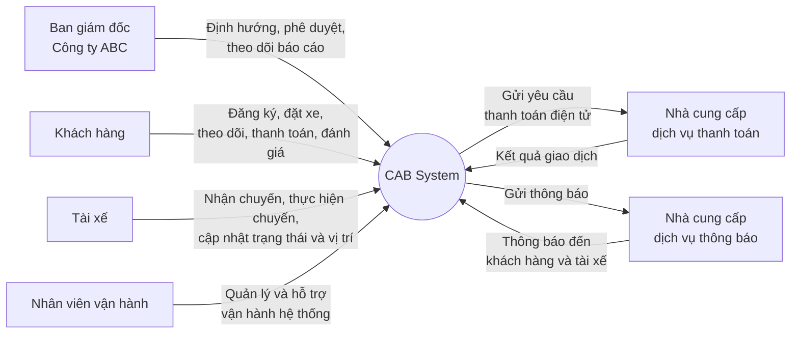
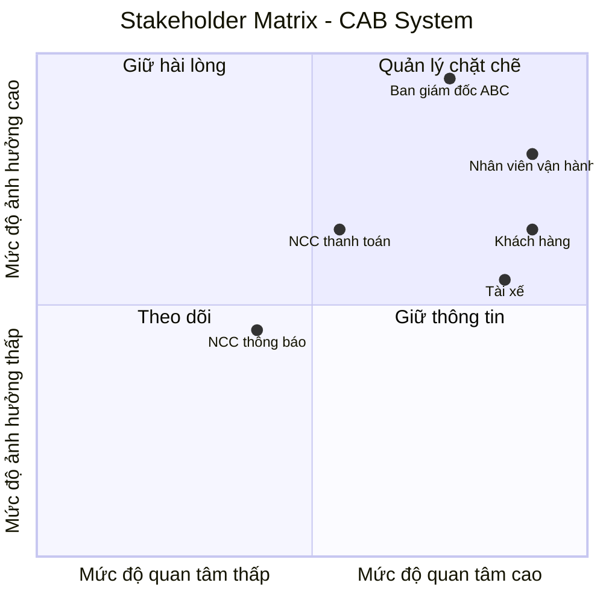
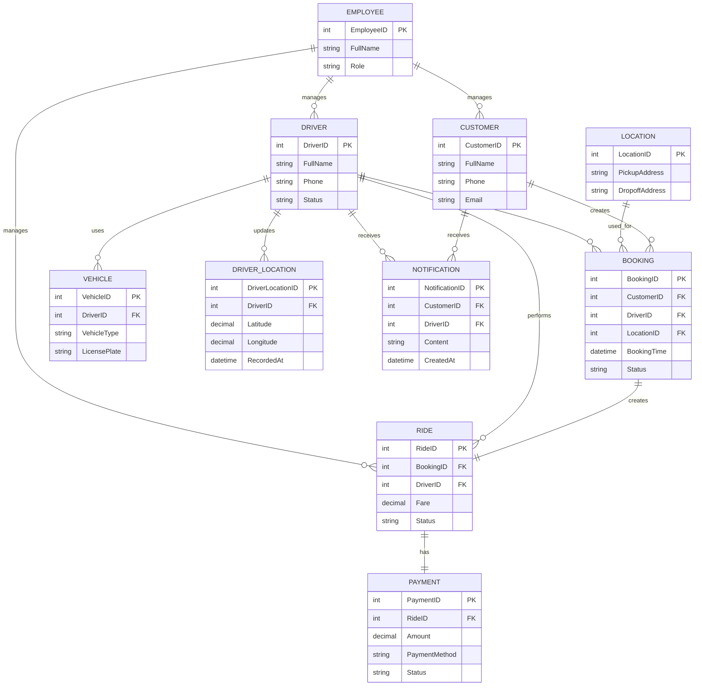

## 1. Tìm kiếm Stakeholders quan trọng

| Tên Stakeholder | Vai trò |
|---|---|
| Ban giám đốc Công ty ABC | Định hướng mục tiêu, phê duyệt yêu cầu và phạm vi hệ thống; theo dõi doanh thu, số lượng chuyến, tỷ lệ hoàn thành, tỷ lệ hủy và hiệu quả hoạt động. |
| Khách hàng | Sử dụng hệ thống để đăng ký, đặt xe, theo dõi chuyến đi, thanh toán, xem lịch sử và đánh giá tài xế. |
| Tài xế | Nhận và thực hiện chuyến đi; cập nhật trạng thái, vị trí, thông tin cá nhân và phương tiện. |
| Nhân viên vận hành | Quản lý khách hàng, tài xế, phương tiện và chuyến đi; theo dõi các chuyến đang diễn ra và hỗ trợ xử lý các trường hợp chuyến bị lỗi. |
| Nhà cung cấp dịch vụ thanh toán | Cung cấp dịch vụ thanh toán điện tử và xử lý các giao dịch thanh toán cho hệ thống CAB. |
| Nhà cung cấp dịch vụ thông báo | Cung cấp các kênh gửi thông báo đến khách hàng và tài xế về đặt xe, chuyến đi và thanh toán. |
## 2. Vẽ sơ đồ mermaid và stakeholders matrix

##  Stakeholder Matrix

## 3. Chuyển đổi yêu cầu khách hàng thành Business Goals (BG)

| Mã BG | Business Goal | Mô tả |
|---|---|---|
| BG01 | Nâng cao hiệu quả dịch vụ đặt xe | Xây dựng nền tảng CAB giúp tự động hóa quy trình từ đặt xe, tìm tài xế, thực hiện chuyến đến thanh toán và đánh giá. |
| BG02 | Rút ngắn thời gian phân công tài xế | Tự động tìm kiếm và ưu tiên tài xế phù hợp, gần khách hàng nhằm tăng tốc độ đáp ứng yêu cầu đặt xe. |
| BG03 | Nâng cao trải nghiệm khách hàng | Cung cấp thông tin minh bạch về tài xế, trạng thái chuyến đi, thời gian dự kiến, thanh toán và lịch sử chuyến. |
| BG04 | Tăng khả năng đáp ứng nhu cầu đặt xe | Đảm bảo hệ thống có khả năng tiếp tục tìm tài xế khác khi tài xế từ chối hoặc không phản hồi, đồng thời thông báo rõ ràng khi không tìm được tài xế. |
| BG05 | Tăng cường hiệu quả quản lý và vận hành | Cung cấp công cụ để nhân viên vận hành quản lý khách hàng, tài xế, phương tiện và chuyến đi, đồng thời hỗ trợ xử lý các trường hợp phát sinh. |
| BG06 | Quản lý tập trung hoạt động và giao dịch | Tập trung dữ liệu chuyến đi, thanh toán và lịch sử giao dịch để hỗ trợ theo dõi và quản lý hoạt động kinh doanh. |
| BG07 | Đảm bảo an toàn và bảo mật dữ liệu | Bảo vệ thông tin cá nhân, thông tin phương tiện, dữ liệu vị trí và dữ liệu giao dịch; kiểm soát quyền truy cập và lưu vết các thao tác quan trọng. |
| BG08 | Đảm bảo tính ổn định và liên tục của dịch vụ | Duy trì hoạt động của hệ thống khi nhu cầu tăng cao và hạn chế việc một thành phần gặp lỗi làm ảnh hưởng đến toàn bộ hệ thống. |
| BG09 | Hỗ trợ mở rộng quy mô kinh doanh | Xây dựng nền tảng có khả năng phục vụ số lượng lớn khách hàng và tài xế, đồng thời cho phép mở rộng các thành phần khi nhu cầu tăng. |
| BG10 | Tạo nền tảng linh hoạt cho phát triển trong tương lai | Cho phép bổ sung loại dịch vụ, phương thức thanh toán, nhà cung cấp thông báo và các chức năng mới mà không phải xây dựng lại toàn bộ hệ thống. |
| BG11 | Hỗ trợ ra quyết định kinh doanh | Cung cấp báo cáo về số lượng chuyến, doanh thu, tỷ lệ hoàn thành, tỷ lệ hủy và hiệu quả hoạt động của tài xế để ban lãnh đạo đánh giá và ra quyết định. |

## Giới hạn module
| Mã Module | Module | Business Goal liên quan |
|---|---|---|
| M01 | Quản lý khách hàng | BG03, BG06 |
| M02 | Quản lý tài xế | BG02, BG04 |
| M03 | Đặt xe và quản lý chuyến đi | BG01, BG02, BG03, BG04 |
| M04 | Quản lý cước và thanh toán | BG01, BG06 |
| M05 | Quản lý vận hành | BG05, BG06, BG08 |
---

## 4. Business Requirements (BR)

| Mã BR | Business Requirement | Business Goal liên quan | Module liên quan |
|---|---|---|---|
| BR01 | Hệ thống phải cung cấp nền tảng đặt xe giúp khách hàng thực hiện đầy đủ quy trình từ tạo yêu cầu đặt xe đến hoàn thành chuyến đi. | BG01 | M01, M03 |
| BR02 | Hệ thống phải tự động tìm kiếm và phân công tài xế phù hợp dựa trên vị trí, trạng thái hoạt động và các tiêu chí vận hành. | BG02 | M02, M03 |
| BR03 | Hệ thống phải cung cấp cho khách hàng thông tin về tài xế, trạng thái chuyến đi, thời gian dự kiến và thông tin thanh toán. | BG03 | M01, M03, M04 |
| BR04 | Hệ thống phải tiếp tục tìm kiếm tài xế khác khi tài xế từ chối hoặc không phản hồi và thông báo cho khách hàng khi không tìm được tài xế. | BG04 | M02, M03 |
| BR05 | Hệ thống phải hỗ trợ nhân viên vận hành quản lý khách hàng, tài xế, phương tiện và các chuyến đi. | BG05 | M01, M02, M05 |
| BR06 | Hệ thống phải tập trung và quản lý dữ liệu chuyến đi, thanh toán và lịch sử giao dịch để phục vụ hoạt động vận hành. | BG06 | M01, M04, M05 |
| BR07 | Hệ thống phải bảo vệ thông tin cá nhân, thông tin phương tiện, dữ liệu vị trí và dữ liệu giao dịch của người dùng. | BG07 | M01, M02, M04, M05 |
| BR08 | Hệ thống phải duy trì hoạt động ổn định khi nhu cầu sử dụng tăng cao và hạn chế ảnh hưởng đến chức năng đặt xe khi một thành phần gặp sự cố. | BG08 | M03, M04, M05 |
| BR09 | Hệ thống phải hỗ trợ mở rộng số lượng khách hàng, tài xế và các thành phần của hệ thống khi quy mô kinh doanh tăng. | BG09 | M01, M02, M03, M05 |
| BR10 | Hệ thống phải cho phép bổ sung loại dịch vụ, phương thức thanh toán và nhà cung cấp thông báo mới mà không phải xây dựng lại toàn bộ hệ thống. | BG10 | M03, M04, M05 |
| BR11 | Hệ thống phải cung cấp báo cáo về số lượng chuyến, doanh thu, tỷ lệ hoàn thành, tỷ lệ hủy và hiệu quả hoạt động của tài xế. | BG11 | M05 |

## 5. Mô hình hóa quy trình nghiệp vụ (BPM)

Dựa trên các Business Requirement (BR), hệ thống CAB được mô hình hóa thành các quy trình nghiệp vụ chính sau:

| Mã BPM | Quy trình nghiệp vụ | Business Requirement liên quan |
|---|---|---|
| BPM01 | Đặt xe và phân công tài xế | BR01, BR02, BR03, BR04 |
| BPM02 | Thực hiện và hoàn thành chuyến đi | BR01, BR03 |
| BPM03 | Tính cước và thanh toán | BR01, BR03, BR06 |
| BPM04 | Quản lý và hỗ trợ vận hành | BR05, BR06, BR07, BR08 |
| BPM05 | Báo cáo và theo dõi hoạt động | BR06, BR11 |
### BPM01 – Đặt xe và phân công tài xế

Mục đích: Cho phép khách hàng tạo yêu cầu đặt xe và hệ thống tìm kiếm, phân công tài xế phù hợp.

| STT | Actor | Hoạt động |
|---|---|---|
| 1 | Khách hàng | Nhập điểm đón, điểm đến và loại xe. |
| 2 | Khách hàng | Gửi yêu cầu đặt xe. |
| 3 | Hệ thống | Tiếp nhận và ghi nhận yêu cầu đặt xe. |
| 4 | Hệ thống | Tìm kiếm tài xế phù hợp dựa trên vị trí, trạng thái hoạt động và tiêu chí vận hành. |
| 5 | Hệ thống | Gửi yêu cầu chuyến đi đến tài xế phù hợp. |
| 6 | Tài xế | Tiếp nhận và phản hồi yêu cầu chuyến đi. |
| 7 | Hệ thống | Nếu tài xế chấp nhận, xác nhận phân công tài xế. |
| 8 | Hệ thống | Nếu tài xế từ chối hoặc không phản hồi, tiếp tục tìm tài xế khác. |
| 9 | Hệ thống | Thông báo thông tin tài xế cho khách hàng khi chuyến được phân công. |
| 10 | Hệ thống | Thông báo cho khách hàng nếu không tìm được tài xế phù hợp. |

### BPM02 – Thực hiện và hoàn thành chuyến đi

Mục đích: Quản lý quá trình tài xế thực hiện chuyến đi từ khi nhận chuyến đến khi hoàn thành.

| STT | Actor | Hoạt động |
|---|---|---|
| 1 | Tài xế | Nhận chuyến đã được phân công. |
| 2 | Tài xế | Di chuyển đến điểm đón. |
| 3 | Tài xế | Cập nhật trạng thái đã đến điểm đón. |
| 4 | Tài xế | Đón khách hàng. |
| 5 | Tài xế | Cập nhật trạng thái đã đón khách. |
| 6 | Tài xế | Thực hiện chuyến đi đến điểm đến. |
| 7 | Tài xế | Cập nhật trạng thái đang di chuyển. |
| 8 | Tài xế | Đến điểm đến. |
| 9 | Tài xế | Cập nhật trạng thái hoàn thành chuyến đi. |
| 10 | Hệ thống | Ghi nhận chuyến đi đã hoàn thành và cập nhật trạng thái chuyến. |

### BPM03 – Tính cước và thanh toán

Mục đích: Xác định số tiền khách hàng phải thanh toán và ghi nhận kết quả thanh toán sau khi chuyến đi hoàn thành.

| STT | Actor | Hoạt động |
|---|---|---|
| 1 | Hệ thống | Nhận thông tin chuyến đi đã hoàn thành. |
| 2 | Hệ thống | Xác định thông tin cần thiết để tính cước. |
| 3 | Hệ thống | Tính số tiền khách hàng phải thanh toán. |
| 4 | Hệ thống | Hiển thị số tiền phải thanh toán cho khách hàng. |
| 5 | Khách hàng | Lựa chọn phương thức thanh toán. |
| 6 | Khách hàng | Thực hiện thanh toán theo phương thức đã chọn. |
| 7 | Hệ thống | Nếu thanh toán tiền mặt, ghi nhận kết quả thanh toán. |
| 8 | Hệ thống | Nếu thanh toán điện tử, gửi yêu cầu đến nhà cung cấp dịch vụ thanh toán. |
| 9 | Nhà cung cấp dịch vụ thanh toán | Xử lý giao dịch và trả kết quả thanh toán. |
| 10 | Hệ thống | Ghi nhận kết quả giao dịch nếu thanh toán thành công. |
| 11 | Hệ thống | Thông báo thanh toán thất bại và cho phép khách hàng thực hiện lại theo chính sách nếu giao dịch không thành công. |

### BPM04 – Quản lý và hỗ trợ vận hành

Mục đích: Hỗ trợ nhân viên vận hành quản lý các đối tượng và xử lý các vấn đề phát sinh trong quá trình hoạt động của hệ thống.

| STT | Actor | Hoạt động |
|---|---|---|
| 1 | Nhân viên vận hành | Đăng nhập vào hệ thống. |
| 2 | Nhân viên vận hành | Theo dõi tình trạng hoạt động của hệ thống. |
| 3 | Nhân viên vận hành | Quản lý thông tin khách hàng. |
| 4 | Nhân viên vận hành | Quản lý thông tin tài xế và phương tiện. |
| 5 | Nhân viên vận hành | Theo dõi các chuyến đi đang diễn ra. |
| 6 | Nhân viên vận hành | Kiểm tra các trường hợp chuyến đi bị lỗi hoặc phát sinh vấn đề. |
| 7 | Nhân viên vận hành | Thực hiện xử lý vấn đề theo quy trình vận hành. |
| 8 | Hệ thống | Cập nhật và lưu kết quả xử lý. |
| 9 | Hệ thống | Ghi nhận các thao tác quản lý và xử lý quan trọng để phục vụ kiểm tra, truy vết. |

### BPM05 – Báo cáo và theo dõi hoạt động

Mục đích: Tổng hợp dữ liệu hoạt động để cung cấp thông tin cho ban giám đốc theo dõi và ra quyết định.

| STT | Actor | Hoạt động |
|---|---|---|
| 1 | Hệ thống | Thu thập dữ liệu chuyến đi. |
| 2 | Hệ thống | Thu thập dữ liệu thanh toán và doanh thu. |
| 3 | Hệ thống | Thu thập dữ liệu hoạt động của tài xế. |
| 4 | Hệ thống | Tổng hợp và xử lý dữ liệu. |
| 5 | Hệ thống | Tạo báo cáo hoạt động. |
| 6 | Ban giám đốc | Xem số lượng chuyến đi. |
| 7 | Ban giám đốc | Xem doanh thu. |
| 8 | Ban giám đốc | Xem tỷ lệ hoàn thành và tỷ lệ hủy chuyến. |
| 9 | Ban giám đốc | Xem hiệu quả hoạt động của tài xế. |
| 10 | Ban giám đốc | Sử dụng thông tin báo cáo để đánh giá và ra quyết định kinh doanh. |

## 6. Thiết kế chức năng nghiệp vụ

| BPM | Chức năng nghiệp vụ | API đề xuất | Mục đích |
|---|---|---|---|
| BPM01 - Đặt xe và phân công tài xế | Chọn điểm đón | API xác định địa điểm đón | Xác định vị trí khách hàng muốn được đón. |
| BPM01 - Đặt xe và phân công tài xế | Chọn điểm đến | API xác định địa điểm đến | Xác định nơi khách hàng muốn di chuyển đến. |
| BPM01 - Đặt xe và phân công tài xế | Chọn loại xe | API lấy danh sách loại xe | Cho phép khách hàng lựa chọn loại xe phù hợp. |
| BPM01 - Đặt xe và phân công tài xế | Tạo yêu cầu đặt xe | API tạo yêu cầu đặt xe | Ghi nhận thông tin chuyến đi và tạo yêu cầu đặt xe. |
| BPM01 - Đặt xe và phân công tài xế | Tìm tài xế | API tìm kiếm tài xế phù hợp | Tìm tài xế dựa trên vị trí, trạng thái hoạt động và tiêu chí vận hành. |
| BPM01 - Đặt xe và phân công tài xế | Phân công tài xế | API phân công tài xế | Gửi yêu cầu và xác nhận tài xế thực hiện chuyến đi. |
| BPM01 - Đặt xe và phân công tài xế | Xử lý tài xế từ chối / không phản hồi | API tìm tài xế tiếp theo | Tiếp tục tìm tài xế khác mà không yêu cầu khách hàng đặt lại chuyến. |
| BPM01 - Đặt xe và phân công tài xế | Thông báo kết quả đặt xe | API gửi thông báo đặt xe | Thông báo cho khách hàng kết quả phân công tài xế. |
| BPM02 - Thực hiện và hoàn thành chuyến đi | Nhận chuyến | API nhận chuyến | Cho phép tài xế chấp nhận chuyến được phân công. |
| BPM02 - Thực hiện và hoàn thành chuyến đi | Cập nhật trạng thái chuyến đi | API cập nhật trạng thái chuyến | Ghi nhận trạng thái hiện tại của chuyến đi. |
| BPM02 - Thực hiện và hoàn thành chuyến đi | Cập nhật vị trí tài xế | API cập nhật vị trí tài xế | Cập nhật vị trí tài xế để hỗ trợ theo dõi và tìm kiếm tài xế. |
| BPM02 - Thực hiện và hoàn thành chuyến đi | Hoàn thành chuyến đi | API hoàn thành chuyến đi | Ghi nhận chuyến đi đã kết thúc. |
| BPM03 - Tính cước và thanh toán | Tính cước chuyến đi | API tính cước | Xác định số tiền khách hàng phải thanh toán. |
| BPM03 - Tính cước và thanh toán | Hiển thị số tiền thanh toán | API lấy thông tin cước | Cung cấp số tiền phải thanh toán cho khách hàng. |
| BPM03 - Tính cước và thanh toán | Thanh toán tiền mặt | API ghi nhận thanh toán tiền mặt | Ghi nhận kết quả thanh toán bằng tiền mặt. |
| BPM03 - Tính cước và thanh toán | Thanh toán điện tử | API tạo giao dịch thanh toán | Gửi yêu cầu thanh toán điện tử đến nhà cung cấp dịch vụ. |
| BPM03 - Tính cước và thanh toán | Xử lý kết quả thanh toán | API cập nhật trạng thái thanh toán | Ghi nhận kết quả thành công hoặc thất bại của giao dịch. |
| BPM03 - Tính cước và thanh toán | Xử lý thanh toán thất bại | API thanh toán lại | Cho phép khách hàng thực hiện lại giao dịch khi thanh toán thất bại. |
| BPM04 - Quản lý và hỗ trợ vận hành | Quản lý khách hàng | API quản lý khách hàng | Quản lý và cập nhật thông tin khách hàng phục vụ vận hành. |
| BPM04 - Quản lý và hỗ trợ vận hành | Quản lý tài xế | API quản lý tài xế | Quản lý thông tin và trạng thái hoạt động của tài xế. |
| BPM04 - Quản lý và hỗ trợ vận hành | Quản lý phương tiện | API quản lý phương tiện | Quản lý thông tin các phương tiện tham gia hoạt động. |
| BPM04 - Quản lý và hỗ trợ vận hành | Theo dõi chuyến đi | API lấy thông tin chuyến đi | Theo dõi tình trạng và thông tin các chuyến đang diễn ra. |
| BPM04 - Quản lý và hỗ trợ vận hành | Xử lý chuyến đi bị lỗi | API xử lý sự cố chuyến đi | Hỗ trợ nhân viên vận hành xử lý các vấn đề phát sinh. |
| BPM04 - Quản lý và hỗ trợ vận hành | Ghi nhận thao tác vận hành | API ghi nhật ký thao tác | Lưu lại các thao tác quan trọng để phục vụ kiểm tra và truy vết. |
| BPM05 - Báo cáo và theo dõi hoạt động | Báo cáo số lượng chuyến | API lấy dữ liệu số lượng chuyến | Cung cấp số lượng chuyến để theo dõi hoạt động. |
| BPM05 - Báo cáo và theo dõi hoạt động | Báo cáo doanh thu | API lấy dữ liệu doanh thu | Cung cấp thông tin doanh thu cho ban giám đốc. |
| BPM05 - Báo cáo và theo dõi hoạt động | Báo cáo tỷ lệ hoàn thành | API lấy tỷ lệ hoàn thành chuyến | Theo dõi mức độ hoàn thành các chuyến đi. |
| BPM05 - Báo cáo và theo dõi hoạt động | Báo cáo tỷ lệ hủy | API lấy tỷ lệ hủy chuyến | Theo dõi tình trạng hủy chuyến trong hệ thống. |
| BPM05 - Báo cáo và theo dõi hoạt động | Báo cáo hiệu quả tài xế | API lấy dữ liệu hiệu quả tài xế | Đánh giá hiệu quả hoạt động của tài xế. |

## 8. System Requirements (SR)

| Mã SR | System Requirement | BPM liên quan | Chức năng nghiệp vụ liên quan |
|---|---|---|---|
| SR01 | Hệ thống phải cho phép khách hàng nhập và xác định điểm đón của chuyến đi. | BPM01 | Chọn điểm đón |
| SR02 | Hệ thống phải cho phép khách hàng nhập và xác định điểm đến của chuyến đi. | BPM01 | Chọn điểm đến |
| SR03 | Hệ thống phải cung cấp danh sách các loại xe để khách hàng lựa chọn. | BPM01 | Chọn loại xe |
| SR04 | Hệ thống phải cho phép khách hàng tạo yêu cầu đặt xe dựa trên điểm đón, điểm đến và loại xe đã chọn. | BPM01 | Tạo yêu cầu đặt xe |
| SR05 | Hệ thống phải tìm kiếm tài xế phù hợp dựa trên vị trí, trạng thái hoạt động và các tiêu chí vận hành. | BPM01 | Tìm tài xế |
| SR06 | Hệ thống phải gửi yêu cầu chuyến đi đến tài xế phù hợp và ghi nhận phản hồi của tài xế. | BPM01 | Phân công tài xế |
| SR07 | Hệ thống phải tiếp tục tìm tài xế khác khi tài xế được đề xuất từ chối hoặc không phản hồi trong thời gian quy định. | BPM01 | Xử lý tài xế từ chối / không phản hồi |
| SR08 | Hệ thống phải thông báo cho khách hàng khi chuyến đi đã được phân công tài xế hoặc khi không tìm được tài xế. | BPM01 | Thông báo kết quả đặt xe |
| SR09 | Hệ thống phải cho phép tài xế chấp nhận chuyến đi được phân công. | BPM02 | Nhận chuyến |
| SR10 | Hệ thống phải cho phép tài xế cập nhật trạng thái chuyến đi theo từng giai đoạn. | BPM02 | Cập nhật trạng thái chuyến đi |
| SR11 | Hệ thống phải ghi nhận và cập nhật vị trí hiện tại của tài xế trong quá trình hoạt động. | BPM02 | Cập nhật vị trí tài xế |
| SR12 | Hệ thống phải cho phép tài xế cập nhật trạng thái hoàn thành chuyến đi. | BPM02 | Hoàn thành chuyến đi |
| SR13 | Hệ thống phải tính số tiền khách hàng phải thanh toán dựa trên thông tin chuyến đi và loại dịch vụ. | BPM03 | Tính cước chuyến đi |
| SR14 | Hệ thống phải hiển thị số tiền khách hàng phải thanh toán sau khi chuyến đi hoàn thành. | BPM03 | Hiển thị số tiền thanh toán |
| SR15 | Hệ thống phải hỗ trợ khách hàng lựa chọn phương thức thanh toán tiền mặt hoặc thanh toán điện tử. | BPM03 | Thanh toán tiền mặt / điện tử |
| SR16 | Hệ thống phải gửi yêu cầu thanh toán điện tử đến nhà cung cấp dịch vụ thanh toán và tiếp nhận kết quả giao dịch. | BPM03 | Thanh toán điện tử |
| SR17 | Hệ thống phải ghi nhận kết quả thanh toán của chuyến đi. | BPM03 | Xử lý kết quả thanh toán |
| SR18 | Hệ thống phải thông báo khi thanh toán điện tử thất bại và cho phép khách hàng thực hiện lại giao dịch theo chính sách. | BPM03 | Xử lý thanh toán thất bại |
| SR19 | Hệ thống phải cho phép nhân viên vận hành quản lý thông tin khách hàng. | BPM04 | Quản lý khách hàng |
| SR20 | Hệ thống phải cho phép nhân viên vận hành quản lý thông tin tài xế và phương tiện. | BPM04 | Quản lý tài xế / phương tiện |
| SR21 | Hệ thống phải cho phép nhân viên vận hành theo dõi các chuyến đi đang diễn ra. | BPM04 | Theo dõi chuyến đi |
| SR22 | Hệ thống phải cho phép nhân viên vận hành ghi nhận và xử lý các trường hợp chuyến đi bị lỗi hoặc phát sinh vấn đề. | BPM04 | Xử lý chuyến đi bị lỗi |
| SR23 | Hệ thống phải ghi nhận nhật ký đối với các thao tác quản lý và xử lý quan trọng. | BPM04 | Ghi nhận thao tác vận hành |
| SR24 | Hệ thống phải tổng hợp dữ liệu chuyến đi, thanh toán và hoạt động tài xế để tạo báo cáo. | BPM05 | Báo cáo và theo dõi hoạt động |
| SR25 | Hệ thống phải cung cấp báo cáo về số lượng chuyến, doanh thu, tỷ lệ hoàn thành, tỷ lệ hủy và hiệu quả hoạt động của tài xế. | BPM05 | Báo cáo hoạt động |
| SR26 | Hệ thống phải yêu cầu người dùng xác thực trước khi sử dụng các chức năng yêu cầu quyền truy cập. | BPM04 | Quản lý và hỗ trợ vận hành |
| SR27 | Hệ thống phải kiểm soát quyền truy cập dựa trên vai trò của khách hàng, tài xế, nhân viên vận hành và ban giám đốc. | BPM04, BPM05 | Quản lý và hỗ trợ vận hành / Báo cáo và theo dõi hoạt động |
| SR28 | Hệ thống phải bảo vệ thông tin cá nhân, thông tin phương tiện, dữ liệu vị trí và dữ liệu giao dịch trong quá trình lưu trữ và truyền tải. | BPM02, BPM03, BPM04 | Cập nhật vị trí tài xế / Thanh toán / Quản lý vận hành |
| SR29 | Hệ thống phải hạn chế việc một thành phần như thanh toán hoặc thông báo gặp sự cố làm gián đoạn toàn bộ quy trình đặt xe. | BPM01, BPM03 | Đặt xe / Thanh toán |
| SR30 | Hệ thống phải có khả năng mở rộng khi số lượng khách hàng, tài xế và chuyến đi tăng. | BPM01, BPM02, BPM04 | Đặt xe / Thực hiện chuyến / Quản lý vận hành |
| SR31 | Hệ thống phải cho phép tích hợp thêm phương thức thanh toán, nhà cung cấp thông báo và loại dịch vụ mới mà không phải xây dựng lại toàn bộ hệ thống. | BPM01, BPM03, BPM04 | Thông báo kết quả đặt xe / Thanh toán / Quản lý vận hành |
| SR32 | Hệ thống phải ghi nhận các thao tác quan trọng của người dùng để phục vụ kiểm tra và truy vết. | BPM04 | Ghi nhận thao tác vận hành |

## 8. Business Rules

| Mã BR | Mô tả |
|---|---|
| BR01 | Khách hàng phải cung cấp đầy đủ điểm đón, điểm đến và loại xe trước khi gửi yêu cầu đặt xe. |
| BR02 | Chỉ những tài xế đang ở trạng thái sẵn sàng nhận chuyến mới được đưa vào danh sách tìm kiếm tài xế. |
| BR03 | Tài xế được ưu tiên phân công dựa trên vị trí gần khách hàng và các tiêu chí vận hành đã được xác định. |
| BR04 | Khi tài xế từ chối hoặc không phản hồi trong thời gian quy định, hệ thống phải chuyển sang tìm tài xế phù hợp tiếp theo. |
| BR05 | Khách hàng không phải tạo lại yêu cầu đặt xe khi hệ thống chuyển sang tìm tài xế khác. |
| BR06 | Một chuyến đi chỉ được phân công cho một tài xế tại một thời điểm. |
| BR07 | Tài xế phải nhận chuyến trước khi được phép thực hiện và cập nhật trạng thái chuyến đi. |
| BR08 | Trạng thái chuyến đi phải được cập nhật theo đúng trình tự từ nhận chuyến, đến điểm đón, đón khách, đang di chuyển và hoàn thành. |
| BR09 | Chỉ tài xế được phân công cho chuyến mới được cập nhật trạng thái và vị trí của chuyến đó. |
| BR10 | Chuyến đi chỉ được chuyển sang trạng thái hoàn thành khi tài xế xác nhận đã đến điểm đến. |
| BR11 | Cước chuyến đi phải được tính dựa trên loại dịch vụ và thông tin thực tế của chuyến đi theo chính sách tính cước của Công ty ABC. |
| BR12 | Khách hàng phải thanh toán số tiền cước được hệ thống xác định sau khi chuyến đi hoàn thành. |
| BR13 | Khi thanh toán điện tử thất bại, hệ thống phải thông báo cho khách hàng và cho phép thực hiện lại theo chính sách thanh toán. |
| BR14 | Hệ thống không được lưu trữ thông tin nhạy cảm của thẻ hoặc tài khoản thanh toán; việc xử lý thông tin này do nhà cung cấp dịch vụ thanh toán thực hiện. |
| BR15 | Chỉ nhân viên vận hành có quyền phù hợp mới được quản lý thông tin khách hàng, tài xế, phương tiện và chuyến đi. |
| BR16 | Chỉ người dùng có vai trò phù hợp mới được truy cập các chức năng tương ứng với vai trò của mình. |
| BR17 | Các thao tác quản lý và xử lý quan trọng phải được ghi nhận để phục vụ kiểm tra và truy vết. |
| BR18 | Báo cáo phải được tổng hợp từ dữ liệu chuyến đi, thanh toán và hoạt động tài xế đã được ghi nhận trong hệ thống. |
| BR19 | Khi không tìm được tài xế phù hợp, hệ thống phải thông báo cho khách hàng thay vì tự động hủy mà không có thông tin. |
| BR20 | Khi một dịch vụ phụ như thanh toán hoặc thông báo gặp sự cố, chức năng đặt xe và quản lý chuyến đi không được bị dừng hoàn toàn. |
## 9. Yêu cầu phi chức năng (NFR)

| Mã NFR | Yêu cầu phi chức năng | Liên quan |
|---|---|---|
| NFR01 | Hệ thống phải đảm bảo người dùng được xác thực trước khi truy cập các chức năng yêu cầu đăng nhập. | BG07, BR07 |
| NFR02 | Hệ thống phải kiểm soát quyền truy cập dựa trên vai trò của khách hàng, tài xế, nhân viên vận hành và ban giám đốc. | BG07, BR07 |
| NFR03 | Hệ thống phải bảo vệ thông tin cá nhân, thông tin phương tiện, dữ liệu vị trí và dữ liệu giao dịch trong quá trình lưu trữ và truyền tải. | BG07, BR07 |
| NFR04 | Hệ thống không được lưu trữ thông tin nhạy cảm của thẻ hoặc tài khoản thanh toán và phải sử dụng nhà cung cấp dịch vụ thanh toán để xử lý thông tin này. | BG07, BR07 |
| NFR05 | Hệ thống phải ghi nhận các thao tác quản lý và xử lý quan trọng để phục vụ kiểm tra và truy vết. | BG07, BR07 |
| NFR06 | Hệ thống phải duy trì hoạt động ổn định khi số lượng người dùng và yêu cầu đặt xe tăng cao. | BG08, BR08 |
| NFR07 | Khi một thành phần như dịch vụ thanh toán hoặc thông báo gặp sự cố, hệ thống phải hạn chế ảnh hưởng đến các chức năng đặt xe và quản lý chuyến đi. | BG08, BR08 |
| NFR08 | Hệ thống phải có khả năng mở rộng khi số lượng khách hàng, tài xế và chuyến đi tăng mà không ảnh hưởng đáng kể đến hoạt động của hệ thống. | BG09, BR09 |
| NFR09 | Hệ thống phải cho phép mở rộng hoặc thay thế các thành phần như dịch vụ thanh toán và dịch vụ thông báo mà không phải xây dựng lại toàn bộ hệ thống. | BG10, BR10 |
| NFR10 | Hệ thống phải hỗ trợ tích hợp với các nhà cung cấp dịch vụ bên ngoài thông qua giao diện tích hợp phù hợp. | BG10, BR10 |
| NFR11 | Hệ thống phải đảm bảo dữ liệu chuyến đi, thanh toán và thông tin người dùng được lưu trữ nhất quán và hạn chế mất mát dữ liệu khi xảy ra sự cố. | BG06, BG08, BR06, BR08 |
| NFR12 | Hệ thống phải đảm bảo các chức năng chính của quy trình đặt xe có thể hoạt động độc lập tương đối với các dịch vụ phụ trợ như thanh toán và thông báo. | BG08, BR08 |
| NFR13 | Hệ thống phải cho phép triển khai hoặc cập nhật từng chức năng mà không yêu cầu dừng toàn bộ hệ thống khi điều kiện kỹ thuật cho phép. | BG08, BG10 |
| NFR14 | Hệ thống phải đảm bảo khả năng phục vụ đồng thời nhiều khách hàng và tài xế trong thời gian cao điểm. | BG08, BG09 |

## 10. Xác định Entity và Mô hình thực thể kết hợp

### 10.1. Xác định các Entity

| Mã Entity | Entity          | Mô tả                                             |
| --------- | --------------- | ------------------------------------------------- |
| **E01**   | Customer        | Lưu thông tin khách hàng sử dụng dịch vụ đặt xe.  |
| **E02**   | Driver          | Lưu thông tin tài xế cung cấp dịch vụ vận chuyển. |
| **E03**   | Vehicle         | Lưu thông tin phương tiện của tài xế.             |
| **E04**   | Booking         | Lưu thông tin yêu cầu đặt xe của khách hàng.      |
| **E05**   | Ride            | Lưu thông tin chuyến xe được thực hiện.           |
| **E06**   | Location        | Lưu thông tin điểm đón và điểm đến.               |
| **E07**   | Payment         | Lưu thông tin giao dịch thanh toán.               |
| **E08**   | Driver_Location | Lưu vị trí GPS của tài xế.                        |
| **E09**   | Notification    | Lưu thông tin thông báo liên quan đến chuyến xe.  |
| **E10**   | Employee        | Lưu thông tin nhân viên vận hành hệ thống.        |

### 10.2. Mối quan hệ giữa các Entity

| Entity 1 | Quan hệ        | Entity 2        | Cardinality |
| -------- | -------------- | --------------- | ----------- |
| Customer | tạo            | Booking         | 1:N         |
| Booking  | sử dụng        | Location        | N:1         |
| Booking  | được phân công | Driver          | N:1         |
| Driver   | sở hữu/sử dụng | Vehicle         | 1:N         |
| Booking  | tạo thành      | Ride            | 1:1         |
| Driver   | thực hiện      | Ride            | 1:N         |
| Ride     | có             | Payment         | 1:1         |
| Driver   | cập nhật       | Driver_Location | 1:N         |
| Customer | nhận           | Notification    | 1:N         |
| Driver   | nhận           | Notification    | 1:N         |
| Employee | quản lý        | Customer        | 1:N         |
| Employee | quản lý        | Driver          | 1:N         |
| Employee | quản lý        | Ride            | 1:N         |

### 10.3. Mô hình thực thể kết hợp (ERD)

@startuml
left to right direction

actor Customer
actor Driver
actor Operator
actor Management
actor Accounting
actor "Payment Provider" as Payment
actor "Notification Provider" as Notification

rectangle "CAB System" {

  usecase "Đăng ký tài khoản" as UC01
  usecase "Đăng nhập" as UC02
  usecase "Đặt xe" as UC03
  usecase "Chọn điểm đón" as UC04
  usecase "Chọn điểm đến" as UC05
  usecase "Chọn loại xe" as UC06
  usecase "Tìm tài xế" as UC07
  usecase "Chọn tài xế" as UC08
  usecase "Xác nhận chuyến xe" as UC09
  usecase "Theo dõi chuyến xe" as UC10
  usecase "Thanh toán" as UC11
  usecase "Xem lịch sử chuyến xe" as UC12
  usecase "Hủy chuyến xe" as UC13

  usecase "Nhận yêu cầu chuyến xe" as UC14
  usecase "Chấp nhận chuyến xe" as UC15
  usecase "Từ chối chuyến xe" as UC16
  usecase "Cập nhật trạng thái chuyến xe" as UC17
  usecase "Cập nhật vị trí GPS" as UC18

  usecase "Quản lý khách hàng" as UC19
  usecase "Quản lý tài xế" as UC20
  usecase "Quản lý chuyến xe" as UC21
  usecase "Theo dõi chuyến xe đang hoạt động" as UC22
  usecase "Quản lý giao dịch" as UC23
  usecase "Xem báo cáo" as UC24
}

Customer --> UC01
Customer --> UC02
Customer --> UC03
Customer --> UC10
Customer --> UC11
Customer --> UC12
Customer --> UC13

UC03 .> UC04 : <<include>>
UC03 .> UC05 : <<include>>
UC03 .> UC06 : <<include>>
UC03 .> UC07 : <<include>>
UC03 .> UC08 : <<include>>
UC03 .> UC09 : <<include>>

Driver --> UC02
Driver --> UC14
Driver --> UC15
Driver --> UC16
Driver --> UC17
Driver --> UC18

Operator --> UC02
Operator --> UC19
Operator --> UC20
Operator --> UC21
Operator --> UC22
Operator --> UC23
Operator --> UC24

Management --> UC24
Accounting --> UC23
Accounting --> UC24

UC11 --> Payment
UC10 --> Notification
UC14 --> Notification

@enduml

## 11. Acceptance Criteria

### 11.1. Bảng tiêu chí chấp nhận

| Mã AC     | SR liên quan | Tiêu chí chấp nhận                                                                                                      |
| --------- | ------------ | ----------------------------------------------------------------------------------------------------------------------- |
| **AC-01** | SR-01        | Khi khách hàng nhập điểm đón hợp lệ, hệ thống phải lưu và hiển thị chính xác điểm đón.                                  |
| **AC-02** | SR-02        | Khi khách hàng nhập điểm đến hợp lệ, hệ thống phải lưu và hiển thị chính xác điểm đến.                                  |
| **AC-03** | SR-03        | Khi điểm đón hoặc điểm đến không hợp lệ, hệ thống phải thông báo lỗi và không tạo yêu cầu đặt xe.                       |
| **AC-04** | SR-04        | Khi thông tin đặt xe hợp lệ, hệ thống phải tạo booking và gán trạng thái ban đầu cho booking.                           |
| **AC-05** | SR-05        | Hệ thống phải hiển thị danh sách các tài xế phù hợp với yêu cầu đặt xe.                                                 |
| **AC-06** | SR-06        | Khách hàng phải có thể chọn một tài xế từ danh sách được đề xuất.                                                       |
| **AC-07** | SR-07        | Sau khi khách hàng xác nhận, hệ thống phải lưu tài xế được chọn cho booking.                                            |
| **AC-08** | SR-08        | Chỉ tài xế có trạng thái trực tuyến và sẵn sàng mới được hệ thống xem xét để nhận chuyến.                               |
| **AC-09** | SR-09        | Khi tài xế thay đổi vị trí, hệ thống phải nhận và cập nhật tọa độ GPS mới.                                              |
| **AC-10** | SR-10        | Hệ thống phải lựa chọn tài xế dựa trên vị trí và trạng thái sẵn sàng.                                                   |
| **AC-11** | SR-11        | Hệ thống phải gửi yêu cầu chuyến xe đến tài xế được lựa chọn/phù hợp.                                                   |
| **AC-12** | SR-12        | Khi tài xế chấp nhận, trạng thái yêu cầu phải được cập nhật thành đã chấp nhận/xác nhận theo quy trình.                 |
| **AC-13** | SR-13        | Khi tài xế từ chối, hệ thống phải ghi nhận việc từ chối và xử lý tìm tài xế khác.                                       |
| **AC-14** | SR-14        | Nếu tài xế không phản hồi trong thời gian quy định, hệ thống phải tự động xử lý yêu cầu hết thời gian.                  |
| **AC-15** | SR-15        | Khi tài xế từ chối hoặc hết thời gian phản hồi, hệ thống phải thực hiện lại quá trình tìm tài xế theo quy định.         |
| **AC-16** | SR-16        | Khách hàng phải nhìn thấy trạng thái hiện tại của chuyến xe và trạng thái phải được cập nhật khi có thay đổi.           |
| **AC-17** | SR-17        | Trong quá trình chuyến xe diễn ra, vị trí tài xế phải được cập nhật trên hệ thống.                                      |
| **AC-18** | SR-18        | Khách hàng phải có thể xem vị trí hiện tại của tài xế trên bản đồ.                                                      |
| **AC-19** | SR-19        | Hệ thống phải hiển thị đúng thông tin tài xế, điểm đón và điểm đến của chuyến xe.                                       |
| **AC-20** | SR-20        | Tài xế phải có thể cập nhật trạng thái chuyến xe theo các trạng thái được hệ thống cho phép.                            |
| **AC-21** | SR-21        | Khi tài xế thực hiện chuyển trạng thái không hợp lệ, hệ thống phải từ chối thao tác và thông báo lỗi.                   |
| **AC-22** | SR-22        | Khi khách hàng hủy chuyến trong điều kiện cho phép, hệ thống phải cập nhật chuyến xe thành trạng thái đã hủy.           |
| **AC-23** | SR-23        | Với cùng một thông tin chuyến xe, hệ thống phải tính giá cước theo công thức được quy định và trả về kết quả.           |
| **AC-24** | SR-24        | Hệ thống phải hiển thị số tiền khách hàng cần thanh toán và số tiền phải khớp với giá cước của chuyến xe.               |
| **AC-25** | SR-25        | Khách hàng phải có thể lựa chọn một phương thức thanh toán hợp lệ.                                                      |
| **AC-26** | SR-26        | Khi thực hiện thanh toán, hệ thống phải tạo một giao dịch gắn với đúng chuyến xe.                                       |
| **AC-27** | SR-27        | Hệ thống phải tiếp nhận và xử lý được kết quả thanh toán từ Payment Provider.                                           |
| **AC-28** | SR-28        | Hệ thống phải lưu đúng một trong các trạng thái PENDING, SUCCESS hoặc FAILED cho giao dịch.                             |
| **AC-29** | SR-29        | Kiểm tra dữ liệu lưu trữ phải đảm bảo hệ thống không lưu thông tin thẻ nhạy cảm.                                        |
| **AC-30** | SR-30        | Khách hàng phải có thể xem danh sách các chuyến xe thuộc tài khoản của mình.                                            |
| **AC-31** | SR-31        | Chi tiết chuyến xe phải hiển thị đầy đủ các thông tin được quy định.                                                    |
| **AC-32** | SR-32        | Thông tin thanh toán hiển thị phải tương ứng với đúng chuyến xe.                                                        |
| **AC-33** | SR-33        | Nhân viên vận hành phải có thể xem, thêm, sửa hoặc quản lý thông tin khách hàng theo quyền được cấp.                    |
| **AC-34** | SR-34        | Nhân viên vận hành phải có thể xem và quản lý thông tin tài xế theo quyền được cấp.                                     |
| **AC-35** | SR-35        | Nhân viên vận hành phải có thể xem danh sách và chi tiết các chuyến xe.                                                 |
| **AC-36** | SR-36        | Hệ thống phải hiển thị danh sách các chuyến xe đang hoạt động để nhân viên vận hành theo dõi.                           |
| **AC-37** | SR-37        | Báo cáo phải hiển thị được tổng số chuyến xe trong khoảng thời gian được chọn.                                          |
| **AC-38** | SR-38        | Báo cáo phải phân biệt được số chuyến hoàn thành và số chuyến bị hủy.                                                   |
| **AC-39** | SR-39        | Báo cáo doanh thu phải được tính từ các giao dịch thanh toán hợp lệ.                                                    |
| **AC-40** | SR-40        | Nhân viên vận hành phải có thể xem thông tin các giao dịch thanh toán.                                                  |
| **AC-41** | SR-41        | Khi Payment Provider hoặc Notification Provider bị lỗi, hệ thống phải ghi nhận sự cố vào log.                           |
| **AC-42** | SR-42        | Khi dịch vụ bên thứ ba tạm thời không hoạt động, yêu cầu đặt xe đã tạo phải vẫn được lưu trên hệ thống.                 |
| **AC-43** | SR-43        | Khi dịch vụ thanh toán hoặc thông báo bị gián đoạn, các chức năng đặt xe và quản lý chuyến xe chính vẫn phải hoạt động. |
| **AC-44** | SR-44        | Sau khi dịch vụ thanh toán được khôi phục, hệ thống phải cho phép thực hiện lại giao dịch FAILED/PENDING theo quy định. |

### 11.2. Nguyên tắc xác nhận

Một **SR được xem là đạt** khi tất cả các **AC liên quan** đến SR đó đều đạt.

* **PASS:** Tất cả tiêu chí AC của SR đều thỏa mãn.
* **FAIL:** Có ít nhất một tiêu chí AC không thỏa mãn.
* Mỗi AC phải có kết quả kiểm thử rõ ràng để xác định yêu cầu có đạt hay không.

## 12. Bảng truy vết yêu cầu

Bảng truy vết được sử dụng để kiểm soát mối liên hệ giữa mục tiêu nghiệp vụ, yêu cầu nghiệp vụ, mô hình quy trình nghiệp vụ, yêu cầu hệ thống, Use Case và tiêu chí chấp nhận.

Chuỗi truy vết của hệ thống:

**BG → BR → PBM → SR → UC → AC**

Trong đó:

* **BG (Business Goal):** Mục tiêu nghiệp vụ.
* **BR (Business Requirement):** Yêu cầu nghiệp vụ.
* **PBM (Process Business Model):** Mô hình quy trình nghiệp vụ.
* **SR (System Requirement):** Yêu cầu hệ thống.
* **UC (Use Case):** Chức năng/ca sử dụng của hệ thống.
* **AC (Acceptance Criteria):** Tiêu chí chấp nhận dùng để xác định yêu cầu đã đạt hay chưa.

### 12.1. Traceability Matrix

| BG    | BR    | PBM    | SR    | UC    | AC                        |
| ----- | ----- | ------ | ----- | ----- | ------------------------- |
| BG-01 | BR-01 | PBM-01 | SR-01 | UC-03 | AC-01.1, AC-01.2          |
| BG-01 | BR-01 | PBM-01 | SR-02 | UC-03 | AC-02.1, AC-02.2          |
| BG-01 | BR-01 | PBM-01 | SR-03 | UC-03 | AC-03.1, AC-03.2, AC-03.3 |
| BG-01 | BR-01 | PBM-01 | SR-04 | UC-03 | AC-04.1, AC-04.2          |
| BG-02 | BR-02 | PBM-02 | SR-05 | UC-03 | AC-05.1, AC-05.2          |
| BG-02 | BR-02 | PBM-02 | SR-06 | UC-05 | AC-06.1, AC-06.2          |
| BG-02 | BR-02 | PBM-02 | SR-07 | UC-06 | AC-07.1, AC-07.2          |
| BG-03 | BR-03 | PBM-03 | SR-08 | UC-07 | AC-08.1                   |
| BG-03 | BR-03 | PBM-03 | SR-09 | UC-17 | AC-09.1, AC-09.2          |
| BG-03 | BR-03 | PBM-03 | SR-10 | UC-07 | AC-10.1, AC-10.2          |
| BG-03 | BR-03 | PBM-03 | SR-11 | UC-07 | AC-11.1                   |
| BG-04 | BR-04 | PBM-04 | SR-12 | UC-14 | AC-12.1                   |
| BG-04 | BR-04 | PBM-04 | SR-13 | UC-15 | AC-13.1                   |
| BG-04 | BR-04 | PBM-04 | SR-14 | UC-14 | AC-14.1                   |
| BG-04 | BR-04 | PBM-04 | SR-15 | UC-07 | AC-15.1, AC-15.2          |
| BG-05 | BR-05 | PBM-05 | SR-16 | UC-10 | AC-16.1, AC-16.2          |
| BG-05 | BR-05 | PBM-05 | SR-17 | UC-17 | AC-17.1                   |
| BG-05 | BR-05 | PBM-05 | SR-18 | UC-10 | AC-18.1, AC-18.2          |
| BG-05 | BR-05 | PBM-05 | SR-19 | UC-10 | AC-19.1                   |
| BG-06 | BR-06 | PBM-06 | SR-20 | UC-16 | AC-20.1, AC-20.2          |
| BG-06 | BR-06 | PBM-06 | SR-21 | UC-16 | AC-21.1                   |
| BG-06 | BR-06 | PBM-06 | SR-22 | UC-13 | AC-22.1, AC-22.2          |
| BG-07 | BR-07 | PBM-07 | SR-23 | UC-03 | AC-23.1, AC-23.2          |
| BG-07 | BR-07 | PBM-07 | SR-24 | UC-03 | AC-24.1                   |
| BG-08 | BR-08 | PBM-08 | SR-25 | UC-11 | AC-25.1                   |
| BG-08 | BR-08 | PBM-08 | SR-26 | UC-11 | AC-26.1, AC-26.2          |
| BG-08 | BR-08 | PBM-08 | SR-27 | UC-11 | AC-27.1                   |
| BG-08 | BR-08 | PBM-08 | SR-28 | UC-11 | AC-28.1, AC-28.2          |
| BG-08 | BR-08 | PBM-08 | SR-29 | UC-11 | AC-29.1                   |
| BG-09 | BR-09 | PBM-09 | SR-30 | UC-12 | AC-30.1                   |
| BG-09 | BR-09 | PBM-09 | SR-31 | UC-12 | AC-31.1, AC-31.2          |
| BG-09 | BR-09 | PBM-09 | SR-32 | UC-12 | AC-32.1                   |
| BG-10 | BR-10 | PBM-10 | SR-33 | UC-19 | AC-33.1                   |
| BG-10 | BR-10 | PBM-10 | SR-34 | UC-20 | AC-34.1                   |
| BG-10 | BR-10 | PBM-10 | SR-35 | UC-21 | AC-35.1                   |
| BG-10 | BR-10 | PBM-10 | SR-36 | UC-22 | AC-36.1                   |
| BG-11 | BR-11 | PBM-11 | SR-37 | UC-24 | AC-37.1                   |
| BG-11 | BR-11 | PBM-11 | SR-38 | UC-24 | AC-38.1                   |
| BG-11 | BR-11 | PBM-11 | SR-39 | UC-24 | AC-39.1                   |
| BG-11 | BR-11 | PBM-11 | SR-40 | UC-23 | AC-40.1                   |
| BG-12 | BR-12 | PBM-12 | SR-41 | UC-21 | AC-41.1                   |
| BG-12 | BR-12 | PBM-12 | SR-42 | UC-03 | AC-42.1                   |
| BG-12 | BR-12 | PBM-12 | SR-43 | UC-03 | AC-43.1                   |
| BG-12 | BR-12 | PBM-12 | SR-44 | UC-11 | AC-44.1                   |

bữa sau đặc tả API. Đặc tả từ SR. Mối SR là một API. 
