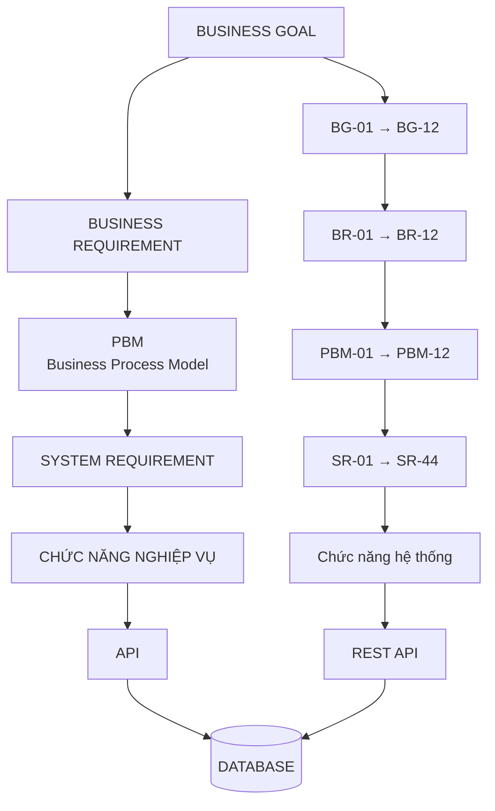

# . BÊN LIÊN QUAN HỆ THỐNG (STAKEHOLDERS)

| Stakeholder                             | Vai trò                                                                                                       |
| --------------------------------------- | ------------------------------------------------------------------------------------------------------------- |
| **Khách hàng (Customer)**               | Người sử dụng dịch vụ, tạo yêu cầu đặt xe, theo dõi chuyến đi, thực hiện thanh toán và xem lịch sử chuyến đi. |
| **Tài xế (Driver)**                     | Cung cấp dịch vụ vận chuyển, nhận hoặc từ chối chuyến, cập nhật trạng thái chuyến và cung cấp vị trí GPS.     |
| **Nhân viên vận hành (Admin/Operator)** | Quản lý khách hàng, tài xế, chuyến đi, hỗ trợ xử lý sự cố và theo dõi hoạt động của hệ thống.                 |
| **Ban Giám Đốc**                        | Sponsor dự án, định hướng phát triển hệ thống, theo dõi tiến độ triển khai và hiệu quả hoạt động kinh doanh.  |
| **Bộ phận Kế toán**                     | Theo dõi doanh thu, quản lý và đối soát các giao dịch thanh toán.                                             |


---

# . CHUYỂN ĐỔI YÊU CẦU KHÁCH HÀNG THÀNH MỤC TIÊU NGHIỆP VỤ

Dựa trên các yêu cầu của khách hàng, hệ thống CAB được chuyển đổi thành các mục tiêu nghiệp vụ (Business Goals). Mỗi mục tiêu được định danh bằng mã **BG** nhằm thuận tiện cho việc quản lý, theo dõi và liên kết với các chức năng của hệ thống.

| Mã BG     | Mục tiêu nghiệp vụ                                                                                                                      |
| --------- | --------------------------------------------------------------------------------------------------------------------------------------- |
| **BG-01** | Cho phép khách hàng tạo yêu cầu chuyến đi bằng cách nhập điểm đón và điểm đến hợp lệ.                                                   |
| **BG-02** | Cho phép khách hàng lựa chọn và xác nhận tài xế được hệ thống đề xuất cho chuyến đi.                                                    |
| **BG-03** | Tự động tìm kiếm và đề xuất tài xế phù hợp dựa trên trạng thái hoạt động, vị trí GPS và khu vực điểm đón.                               |
| **BG-04** | Cho phép tài xế nhận hoặc từ chối chuyến trong thời gian quy định và tự động tìm tài xế khác khi từ chối hoặc hết thời gian chờ.        |
| **BG-05** | Cho phép khách hàng theo dõi trạng thái chuyến đi và vị trí tài xế theo thời gian thực.                                                 |
| **BG-06** | Cho phép tài xế cập nhật trạng thái chuyến đi trong suốt quá trình thực hiện chuyến.                                                    |
| **BG-07** | Tự động xác định số tiền khách hàng cần thanh toán và tạo thông tin thanh toán cho chuyến đi.                                           |
| **BG-08** | Cho phép khách hàng thực hiện thanh toán và quản lý trạng thái giao dịch.                                                               |
| **BG-09** | Cho phép khách hàng xem lại lịch sử chuyến đi và thông tin thanh toán liên quan.                                                        |
| **BG-10** | Hỗ trợ nhân viên vận hành quản lý khách hàng, tài xế, chuyến đi và xử lý các sự cố trong quá trình vận hành.                            |
| **BG-11** | Cung cấp các báo cáo cơ bản về chuyến đi, doanh thu, khách hàng và tài xế để hỗ trợ quản lý.                                            |
| **BG-12** | Đảm bảo hoạt động đặt xe và các chức năng chính của hệ thống vẫn được duy trì khi dịch vụ thanh toán hoặc thông báo gặp sự cố tạm thời. |


---


# . PHẠM VI MODULE HỆ THỐNG (SYSTEM MODULES)

Để đảm bảo dự án CAB System có thể hoàn thành trong thời gian 7 tuần, hệ thống được giới hạn trong 5 module chính.

##  Module 1 - Quản lý Khách hàng (Customer Management)

**Mục đích:**
Quản lý tài khoản và thông tin cơ bản của khách hàng, phục vụ quá trình đặt xe và sử dụng dịch vụ.

**Business Goal:** BG-02, BG-04

| STT | Chức năng MVP                |
| --: | ---------------------------- |
|   1 | Đăng ký tài khoản            |
|   2 | Đăng nhập / đăng xuất        |
|   3 | Xem thông tin cá nhân        |
|   4 | Cập nhật thông tin cá nhân   |
|   5 | Quản lý trạng thái tài khoản |
|   6 | Xem lịch sử chuyến đi        |

##  Module 2 - Quản lý Tài xế (Driver Management)

**Mục đích:**
Quản lý thông tin tài xế và trạng thái hoạt động, làm cơ sở cho việc tự động ghép tài xế với khách hàng.

**Business Goal:** BG-01, BG-04, BG-05

| STT | Chức năng MVP                        |
| --: | ------------------------------------ |
|   1 | Đăng nhập tài khoản tài xế           |
|   2 | Xem / cập nhật thông tin tài xế      |
|   3 | Cập nhật trạng thái Online / Offline |
|   4 | Cập nhật trạng thái Available / Busy |
|   5 | Cập nhật vị trí GPS                  |
|   6 | Nhận đề xuất chuyến                  |
|   7 | Chấp nhận chuyến                     |
|   8 | Từ chối chuyến                       |
|   9 | Xem lịch sử chuyến                   |

## . Module 3 - Đặt xe & Ghép tài xế (Booking & Matching)

**Mục đích:**
Là module nghiệp vụ cốt lõi của CAB System, chịu trách nhiệm tiếp nhận yêu cầu đặt xe và tự động tìm tài xế phù hợp.

**Business Goal:** BG-01, BG-02, BG-05

| STT | Chức năng MVP                    |
| --: | -------------------------------- |
|   1 | Nhập điểm đón                    |
|   2 | Nhập điểm đến                    |
|   3 | Tạo yêu cầu đặt xe               |
|   4 | Tính giá dự kiến                 |
|   5 | Tìm tài xế phù hợp               |
|   6 | Gửi đề xuất chuyến cho tài xế    |
|   7 | Xử lý tài xế chấp nhận / từ chối |
|   8 | Xử lý Timeout                    |
|   9 | Retry tìm tài xế                 |
|  10 | Xác nhận tài xế                  |
|  11 | Hủy chuyến                       |
|  12 | Quản lý trạng thái chuyến        |

### Trạng thái chuyến

| STT | Trạng thái          |
| --: | ------------------- |
|   1 | KHOI_TAO            |
|   2 | TIM_TAI_XE          |
|   3 | CHO_TAI_XE_XAC_NHAN |
|   4 | DA_NHAN_CHUYEN      |
|   5 | DA_DEN_DIEM_DON     |
|   6 | DA_DON_KHACH        |
|   7 | DANG_DI_CHUYEN      |
|   8 | HOAN_THANH          |
|   9 | HUY_CHUYEN          |

## . Module 4 - Theo dõi Chuyến & Thanh toán (Ride Tracking & Payment)

**Mục đích:**
Quản lý quá trình thực hiện chuyến đi, cập nhật vị trí tài xế và xử lý thanh toán sau khi chuyến hoàn thành.

**Business Goal:** BG-02, BG-03, BG-05

| Nhóm            | STT | Chức năng MVP                         |
| --------------- | --: | ------------------------------------- |
| Theo dõi chuyến |   1 | Theo dõi chuyến                       |
| Theo dõi chuyến |   2 | Cập nhật vị trí GPS tài xế            |
| Theo dõi chuyến |   3 | Hiển thị vị trí tài xế cho khách hàng |
| Theo dõi chuyến |   4 | Cập nhật trạng thái chuyến            |
| Theo dõi chuyến |   5 | Tài xế xác nhận đã đến điểm đón       |
| Theo dõi chuyến |   6 | Tài xế xác nhận đã đón khách          |
| Theo dõi chuyến |   7 | Tài xế bắt đầu chuyến                 |
| Theo dõi chuyến |   8 | Tài xế hoàn thành chuyến              |
| Thanh toán      |   9 | Tính cước chuyến                      |
| Thanh toán      |  10 | Chọn phương thức thanh toán           |
| Thanh toán      |  11 | Tạo giao dịch                         |
| Thanh toán      |  12 | Gửi giao dịch đến Payment Provider    |
| Thanh toán      |  13 | Nhận kết quả thanh toán               |
| Thanh toán      |  14 | Lưu trạng thái giao dịch              |
| Thanh toán      |  15 | Xử lý thanh toán thất bại             |

##  Module 5 - Quản trị & Vận hành (Admin & Operation)

**Mục đích:**
Cung cấp công cụ cho nhân viên vận hành quản lý khách hàng, tài xế và giám sát chuyến đi.

**Business Goal:** BG-03, BG-04, BG-05

| STT | Chức năng MVP                              |
| --: | ------------------------------------------ |
|   1 | Đăng nhập Admin / Operator                 |
|   2 | Quản lý khách hàng                         |
|   3 | Quản lý tài xế                             |
|   4 | Xem trạng thái Online / Offline của tài xế |
|   5 | Xem danh sách chuyến đi                    |
|   6 | Xem chi tiết chuyến đi                     |
|   7 | Theo dõi chuyến đang hoạt động             |
|   8 | Hỗ trợ xử lý chuyến lỗi                    |
|   9 | Xem giao dịch thanh toán                   |
|  10 | Xem báo cáo cơ bản                         |

## 4.6. Tổng quan phạm vi Module

| Module              | Vai trò chính         |
| ------------------- | --------------------- |
| Customer Management | Quản lý khách hàng    |
| Driver Management   | Quản lý tài xế        |
| Booking & Matching  | Đặt xe và ghép tài xế |
| Ride Tracking       | Theo dõi chuyến       |
| Payment             | Thanh toán            |
| Admin & Operation   | Quản trị và vận hành  |

**Giới hạn MVP:**
Không triển khai các chức năng nâng cao như Loyalty, Voucher nâng cao, Carpooling, Dynamic Pricing phức tạp, AI/ML, BI nâng cao và quản lý tài chính chuyên sâu.

---

#  BUSINESS REQUIREMENTS (BR)

Phần này mô tả các yêu cầu nghiệp vụ mà hệ thống CAB System phải đáp ứng để hỗ trợ quy trình đặt xe, quản lý tài xế, theo dõi chuyến đi, thanh toán và vận hành hệ thống.

## 5.1. Danh sách Business Requirements

| Mã    | Business Requirement                                                                                                                          | Module                           |
| ----- | --------------------------------------------------------------------------------------------------------------------------------------------- | -------------------------------- |
| BG-01 | Hệ thống phải cho phép khách hàng tạo yêu cầu chuyến đi bằng cách nhập điểm đón và điểm đến.                                                  | Quản lý Khách hàng / Đặt xe      |
| BG-02 | Hệ thống phải cho phép khách hàng lựa chọn tài xế được hệ thống đề xuất và xác nhận chuyến đi.                                                | Đặt xe & Ghép tài xế             |
| BG-03 | Hệ thống phải tự động tìm kiếm và đề xuất tài xế phù hợp dựa trên trạng thái hoạt động và vị trí hiện tại.                                    | Quản lý Tài xế / Matching        |
| BG-04 | Hệ thống phải cho phép tài xế nhận hoặc từ chối yêu cầu chuyến đi trong một khoảng thời gian xác định.                                        | Quản lý Tài xế                   |
| BG-05 | Hệ thống phải cho phép khách hàng theo dõi trạng thái chuyến đi và vị trí tài xế trong quá trình thực hiện chuyến.                            | Theo dõi Chuyến                  |
| BG-06 | Hệ thống phải cho phép tài xế cập nhật trạng thái chuyến từ khi nhận chuyến đến khi hoàn thành hoặc hủy chuyến.                               | Quản lý Tài xế / Theo dõi Chuyến |
| BG-07 | Hệ thống phải tự động tính cước chuyến dựa trên thông tin chuyến đi và cung cấp số tiền cần thanh toán cho khách hàng.                        | Thanh toán                       |
| BG-08 | Hệ thống phải cho phép khách hàng thực hiện thanh toán và lưu lại trạng thái của giao dịch.                                                   | Thanh toán                       |
| BG-09 | Hệ thống phải cho phép khách hàng xem lịch sử các chuyến đi và thông tin thanh toán tương ứng.                                                | Quản lý Khách hàng               |
| BG-10 | Hệ thống phải cho phép nhân viên vận hành quản lý khách hàng, tài xế và theo dõi các chuyến đi đang hoạt động.                                | Quản trị & Vận hành              |
| BG-11 | Hệ thống phải cho phép nhân viên vận hành xem thông tin giao dịch và báo cáo cơ bản về số chuyến, chuyến hoàn thành, chuyến hủy và doanh thu. | Quản trị & Vận hành              |
| BG-12 | Hệ thống phải đảm bảo các chức năng đặt xe vẫn hoạt động khi dịch vụ thanh toán hoặc thông báo gặp sự cố tạm thời.                            | Toàn hệ thống                    |

---

#  CHI TIẾT BUSINESS REQUIREMENTS

## BG-01 - Tạo yêu cầu chuyến đi

**Mô tả:**
Hệ thống phải cho phép khách hàng tạo yêu cầu chuyến đi bằng cách nhập thông tin điểm đón và điểm đến.

| Loại      | Nội dung                                       |
| --------- | ---------------------------------------------- |
| Điều kiện | Khách hàng đã đăng nhập                        |
| Điều kiện | Điểm đón hợp lệ                                |
| Điều kiện | Điểm đến hợp lệ                                |
| Kết quả   | Hệ thống tạo một yêu cầu chuyến đi             |
| Kết quả   | Yêu cầu được chuyển sang trạng thái TIM_TAI_XE |

## BG-02 - Lựa chọn và xác nhận tài xế

**Mô tả:**
Hệ thống phải cho phép khách hàng lựa chọn tài xế được hệ thống đề xuất và xác nhận chuyến đi.

| Kết quả                                      |
| -------------------------------------------- |
| Tài xế được gán vào chuyến                   |
| Chuyến chuyển sang trạng thái DA_NHAN_CHUYEN |

## BG-03 - Tự động ghép tài xế

**Mô tả:**
Hệ thống phải tự động tìm kiếm và đề xuất tài xế phù hợp cho yêu cầu chuyến đi.

| STT | Tiêu chí lựa chọn                   |
| --: | ----------------------------------- |
|   1 | Tài xế đang Online                  |
|   2 | Tài xế đang Available               |
|   3 | Tài xế có vị trí GPS hợp lệ         |
|   4 | Tài xế phù hợp với khu vực điểm đón |

**Kết quả:**

| STT | Kết quả                                                            |
| --: | ------------------------------------------------------------------ |
|   1 | Hệ thống gửi đề xuất chuyến đến tài xế                             |
|   2 | Nếu tài xế từ chối hoặc Timeout, hệ thống tiếp tục tìm tài xế khác |

## BG-04 - Tài xế nhận hoặc từ chối chuyến

**Mô tả:**
Hệ thống phải cho phép tài xế nhận hoặc từ chối yêu cầu chuyến đi trong thời gian quy định.

| Hành động | Kết quả                                                      |
| --------- | ------------------------------------------------------------ |
| Accept    | Chuyến được xác nhận                                         |
| Reject    | Hệ thống tìm tài xế khác                                     |
| Timeout   | Hệ thống xem như tài xế không nhận chuyến và thực hiện Retry |

## BG-05 - Theo dõi chuyến đi

**Mô tả:**
Hệ thống phải cho phép khách hàng theo dõi trạng thái chuyến và vị trí tài xế theo thời gian thực.

| STT | Thông tin hiển thị         |
| --: | -------------------------- |
|   1 | Vị trí hiện tại của tài xế |
|   2 | Trạng thái chuyến          |
|   3 | Thông tin tài xế           |
|   4 | Điểm đón                   |
|   5 | Điểm đến                   |

## BG-06 - Cập nhật trạng thái chuyến

**Mô tả:**
Hệ thống phải cho phép tài xế cập nhật trạng thái chuyến trong quá trình thực hiện.

| STT | Trạng thái      |
| --: | --------------- |
|   1 | DA_NHAN_CHUYEN  |
|   2 | DA_DEN_DIEM_DON |
|   3 | DA_DON_KHACH    |
|   4 | DANG_DI_CHUYEN  |
|   5 | HOAN_THANH      |
|   6 | HUY_CHUYEN      |

**Điều kiện hủy:**
Chuyến có thể chuyển sang HUY_CHUYEN khi khách hàng hoặc tài xế thực hiện hủy chuyến theo quy định.


## BG-08 - Thanh toán chuyến đi

**Mô tả:**
Hệ thống phải cho phép khách hàng thực hiện thanh toán và lưu lại trạng thái giao dịch.

| Trạng thái | Ý nghĩa                  |
| ---------- | ------------------------ |
| PENDING    | Giao dịch đang chờ xử lý |
| SUCCESS    | Thanh toán thành công    |
| FAILED     | Thanh toán thất bại      |

Hệ thống không lưu thông tin thẻ nhạy cảm mà chỉ lưu thông tin cần thiết để quản lý giao dịch.

## BG-09 - Lịch sử chuyến đi

**Mô tả:**
Hệ thống phải cho phép khách hàng xem lại lịch sử các chuyến đã thực hiện.

| STT | Thông tin             |
| --: | --------------------- |
|   1 | Mã chuyến             |
|   2 | Thời gian             |
|   3 | Điểm đón              |
|   4 | Điểm đến              |
|   5 | Tài xế                |
|   6 | Trạng thái chuyến     |
|   7 | Số tiền thanh toán    |
|   8 | Trạng thái thanh toán |

#  MÔ HÌNH HÓA NGHIỆP VỤ (BUSINESS PROCESS MODELING)

##  Tổng quan các quy trình nghiệp vụ

Dựa trên các Business Requirements từ BG-01 đến BG-09, hệ thống CAB có thể được mô hình hóa thành các quy trình nghiệp vụ chính sau:

| STT | Quy trình nghiệp vụ             | Business Requirement liên quan |
| --: | ------------------------------- | ------------------------------ |
|   1 | Tạo yêu cầu chuyến đi           | BG-01                          |
|   2 | Lựa chọn và xác nhận tài xế     | BG-02                          |
|   3 | Tự động ghép tài xế             | BG-03                          |
|   4 | Tài xế nhận hoặc từ chối chuyến | BG-04                          |
|   5 | Theo dõi chuyến đi              | BG-05                          |
|   6 | Cập nhật trạng thái chuyến      | BG-06                          |
|   7 | Thanh toán chuyến đi            | BG-08                          |
|   8 | Xem lịch sử chuyến đi           | BG-09                          |

> **Lưu ý:** Nội dung BG-07 không được cung cấp trong phần Business Requirements trên, nên không đưa vào mô hình chi tiết để tránh tự bổ sung thông tin ngoài tài liệu.

---

##  Quy trình tạo yêu cầu chuyến đi

**Mục đích:** Cho phép khách hàng tạo một yêu cầu chuyến đi bằng cách cung cấp điểm đón và điểm đến.

| Thành phần           | Nội dung                                               |
| -------------------- | ------------------------------------------------------ |
| Actor chính          | Khách hàng                                             |
| Điều kiện trước      | Khách hàng đã đăng nhập                                |
| Dữ liệu đầu vào      | Điểm đón, điểm đến                                     |
| Xử lý                | Hệ thống kiểm tra tính hợp lệ của điểm đón và điểm đến |
| Kết quả              | Tạo yêu cầu chuyến đi                                  |
| Trạng thái tiếp theo | TIM_TAI_XE                                             |

**Luồng nghiệp vụ:**

| Bước | Hoạt động                                      |
| ---: | ---------------------------------------------- |
|    1 | Khách hàng đăng nhập hệ thống                  |
|    2 | Khách hàng nhập điểm đón                       |
|    3 | Khách hàng nhập điểm đến                       |
|    4 | Hệ thống kiểm tra tính hợp lệ của thông tin    |
|    5 | Hệ thống tạo yêu cầu chuyến đi                 |
|    6 | Yêu cầu được chuyển sang trạng thái TIM_TAI_XE |

---

## . Quy trình tự động ghép và xác nhận tài xế

**Mục đích:** Tìm kiếm tài xế phù hợp và thực hiện xác nhận chuyến đi.

###  Tiêu chí tìm kiếm tài xế

| STT | Tiêu chí                            |
| --: | ----------------------------------- |
|   1 | Tài xế đang Online                  |
|   2 | Tài xế đang Available               |
|   3 | Tài xế có vị trí GPS hợp lệ         |
|   4 | Tài xế phù hợp với khu vực điểm đón |

### Luồng nghiệp vụ

| Bước | Hoạt động                                                                 |
| ---: | ------------------------------------------------------------------------- |
|    1 | Hệ thống nhận yêu cầu chuyến ở trạng thái TIM_TAI_XE                      |
|    2 | Hệ thống tìm kiếm tài xế phù hợp theo các tiêu chí                        |
|    3 | Hệ thống gửi đề xuất chuyến đến tài xế                                    |
|    4 | Tài xế lựa chọn Accept hoặc Reject                                        |
|    5 | Nếu Accept, chuyến được xác nhận                                          |
|    6 | Nếu Reject, hệ thống tìm tài xế khác                                      |
|    7 | Nếu Timeout, hệ thống xem tài xế như không nhận chuyến và thực hiện Retry |
|    8 | Khi tài xế được xác nhận, chuyến chuyển sang trạng thái DA_NHAN_CHUYEN    |

---

## Quy trình theo dõi và thực hiện chuyến đi

**Mục đích:** Cho phép khách hàng theo dõi thông tin chuyến đi và vị trí tài xế theo thời gian thực.

### Thông tin được hiển thị

| STT | Thông tin                  |
| --: | -------------------------- |
|   1 | Vị trí hiện tại của tài xế |
|   2 | Trạng thái chuyến          |
|   3 | Thông tin tài xế           |
|   4 | Điểm đón                   |
|   5 | Điểm đến                   |

###  Luồng cập nhật trạng thái

| STT | Trạng thái      |
| --: | --------------- |
|   1 | DA_NHAN_CHUYEN  |
|   2 | DA_DEN_DIEM_DON |
|   3 | DA_DON_KHACH    |
|   4 | DANG_DI_CHUYEN  |
|   5 | HOAN_THANH      |
|   6 | HUY_CHUYEN      |

**Luồng nghiệp vụ:**

| Bước | Hoạt động                                                                                                    |
| ---: | ------------------------------------------------------------------------------------------------------------ |
|    1 | Tài xế nhận chuyến                                                                                           |
|    2 | Tài xế di chuyển đến điểm đón                                                                                |
|    3 | Tài xế cập nhật trạng thái DA_DEN_DIEM_DON                                                                   |
|    4 | Tài xế đón khách và cập nhật DA_DON_KHACH                                                                    |
|    5 | Tài xế thực hiện chuyến và cập nhật DANG_DI_CHUYEN                                                           |
|    6 | Khi đến điểm đến, tài xế cập nhật HOAN_THANH                                                                 |
|    7 | Trong quá trình thực hiện, chuyến có thể chuyển sang HUY_CHUYEN khi khách hàng hoặc tài xế hủy theo quy định |
|    8 | Khách hàng theo dõi trạng thái và vị trí tài xế trên hệ thống                                                |

---

## Quy trình thanh toán chuyến đi

**Mục đích:** Cho phép khách hàng thanh toán và hệ thống quản lý trạng thái giao dịch.

| Thành phần         | Nội dung                                            |
| ------------------ | --------------------------------------------------- |
| Actor chính        | Khách hàng                                          |
| Đầu vào            | Yêu cầu thanh toán chuyến đi                        |
| Xử lý              | Hệ thống thực hiện và cập nhật trạng thái giao dịch |
| Kết quả            | Lưu trạng thái giao dịch                            |
| Thông tin nhạy cảm | Hệ thống không lưu thông tin thẻ nhạy cảm           |

### Trạng thái giao dịch

| Trạng thái | Ý nghĩa                  |
| ---------- | ------------------------ |
| PENDING    | Giao dịch đang chờ xử lý |
| SUCCESS    | Thanh toán thành công    |
| FAILED     | Thanh toán thất bại      |

### Luồng nghiệp vụ

| Bước | Hoạt động                                                 |
| ---: | --------------------------------------------------------- |
|    1 | Khách hàng thực hiện thanh toán                           |
|    2 | Hệ thống tạo/xử lý giao dịch                              |
|    3 | Giao dịch ở trạng thái PENDING                            |
|    4 | Nếu thanh toán thành công, trạng thái chuyển sang SUCCESS |
|    5 | Nếu thanh toán thất bại, trạng thái chuyển sang FAILED    |
|    6 | Hệ thống lưu thông tin cần thiết để quản lý giao dịch     |

---

## 6.6. Quy trình xem lịch sử chuyến đi

**Mục đích:** Cho phép khách hàng xem lại các chuyến đi đã thực hiện và thông tin thanh toán liên quan.

### Thông tin lịch sử

| STT | Thông tin             |
| --: | --------------------- |
|   1 | Mã chuyến             |
|   2 | Thời gian             |
|   3 | Điểm đón              |
|   4 | Điểm đến              |
|   5 | Tài xế                |
|   6 | Trạng thái chuyến     |
|   7 | Số tiền thanh toán    |
|   8 | Trạng thái thanh toán |

### Luồng nghiệp vụ

| Bước | Hoạt động                                                |
| ---: | -------------------------------------------------------- |
|    1 | Khách hàng truy cập chức năng lịch sử chuyến đi          |
|    2 | Hệ thống lấy danh sách các chuyến đã thực hiện           |
|    3 | Hệ thống hiển thị thông tin từng chuyến                  |
|    4 | Khách hàng xem thông tin chuyến và trạng thái thanh toán |

---

##  Tổng hợp luồng nghiệp vụ chính

| Bước | Quy trình                       | Trạng thái / Kết quả             |
| ---: | ------------------------------- | -------------------------------- |
|    1 | Khách hàng tạo yêu cầu chuyến   | TIM_TAI_XE                       |
|    2 | Hệ thống tìm tài xế phù hợp     | Tài xế được đề xuất              |
|    3 | Tài xế nhận chuyến              | DA_NHAN_CHUYEN                   |
|    4 | Tài xế đến điểm đón             | DA_DEN_DIEM_DON                  |
|    5 | Tài xế đón khách                | DA_DON_KHACH                     |
|    6 | Tài xế thực hiện chuyến         | DANG_DI_CHUYEN                   |
|    7 | Chuyến hoàn thành               | HOAN_THANH                       |
|    8 | Khách hàng thực hiện thanh toán | PENDING / SUCCESS / FAILED       |
|    9 | Hệ thống lưu thông tin chuyến   | Hiển thị trong lịch sử chuyến đi |

### Luồng xử lý khi tài xế không nhận chuyến

| Tình huống                 | Xử lý                                       |
| -------------------------- | ------------------------------------------- |
| Tài xế Accept              | Chuyến được xác nhận                        |
| Tài xế Reject              | Hệ thống tìm tài xế khác                    |
| Tài xế Timeout             | Hệ thống thực hiện Retry và tìm tài xế khác |
| Không có tài xế phù hợp    | Tiếp tục tìm kiếm theo cơ chế của hệ thống  |
| Khách hàng hoặc tài xế hủy | Chuyến chuyển sang HUY_CHUYEN               |


# 7. SYSTEM REQUIREMENTS (SR)

Phần này chuyển các Business Requirements (BR) thành các System Requirements (SR) cụ thể mà hệ thống CAB System phải đáp ứng. Mỗi SR được liên kết với Business Goal và Business Requirement tương ứng nhằm đảm bảo khả năng truy xuất từ mục tiêu nghiệp vụ đến chức năng hệ thống.

## 7.1. Ma trận Business Goal – Business Requirement – System Requirement

| Business Goal | Business Requirement                   | Mã SR     | System Requirement                                                                                 |
| ------------- | -------------------------------------- | --------- | -------------------------------------------------------------------------------------------------- |
| **BG-01**     | Cho phép khách hàng tạo yêu cầu chuyến | **SR-01** | Hệ thống phải cho phép khách hàng nhập điểm đón hợp lệ.                                            |
| **BG-01**     | Cho phép khách hàng tạo yêu cầu chuyến | **SR-02** | Hệ thống phải cho phép khách hàng nhập điểm đến hợp lệ.                                            |
| **BG-01**     | Cho phép khách hàng tạo yêu cầu chuyến | **SR-03** | Hệ thống phải kiểm tra tính hợp lệ của điểm đón và điểm đến trước khi tạo chuyến.                  |
| **BG-01**     | Cho phép khách hàng tạo yêu cầu chuyến | **SR-04** | Hệ thống phải tạo yêu cầu đặt xe và gán trạng thái TIM_TAI_XE khi thông tin hợp lệ.                |
| **BG-02**     | Khách hàng lựa chọn và xác nhận tài xế | **SR-05** | Hệ thống phải hiển thị tài xế được hệ thống đề xuất cho khách hàng.                                |
| **BG-02**     | Khách hàng lựa chọn và xác nhận tài xế | **SR-06** | Hệ thống phải cho phép khách hàng lựa chọn tài xế được đề xuất.                                    |
| **BG-02**     | Khách hàng lựa chọn và xác nhận tài xế | **SR-07** | Hệ thống phải cho phép khách hàng xác nhận tài xế đã lựa chọn.                                     |
| **BG-03**     | Tự động tìm kiếm tài xế                | **SR-08** | Hệ thống phải tìm các tài xế đang Online và Available.                                             |
| **BG-03**     | Tự động tìm kiếm tài xế                | **SR-09** | Hệ thống phải kiểm tra vị trí GPS của tài xế.                                                      |
| **BG-03**     | Tự động tìm kiếm tài xế                | **SR-10** | Hệ thống phải lựa chọn tài xế phù hợp với khu vực điểm đón.                                        |
| **BG-03**     | Tự động tìm kiếm tài xế                | **SR-11** | Hệ thống phải gửi đề xuất chuyến đến tài xế phù hợp.                                               |
| **BG-04**     | Tài xế nhận hoặc từ chối chuyến        | **SR-12** | Hệ thống phải cho phép tài xế chấp nhận yêu cầu chuyến.                                            |
| **BG-04**     | Tài xế nhận hoặc từ chối chuyến        | **SR-13** | Hệ thống phải cho phép tài xế từ chối yêu cầu chuyến.                                              |
| **BG-04**     | Tài xế nhận hoặc từ chối chuyến        | **SR-14** | Hệ thống phải xác định Timeout khi tài xế không phản hồi trong thời gian quy định.                 |
| **BG-04**     | Tài xế nhận hoặc từ chối chuyến        | **SR-15** | Hệ thống phải thực hiện Retry khi tài xế từ chối hoặc Timeout.                                     |
| **BG-05**     | Theo dõi chuyến đi                     | **SR-16** | Hệ thống phải hiển thị trạng thái hiện tại của chuyến đi cho khách hàng.                           |
| **BG-05**     | Theo dõi chuyến đi                     | **SR-17** | Hệ thống phải cập nhật vị trí GPS hiện tại của tài xế.                                             |
| **BG-05**     | Theo dõi chuyến đi                     | **SR-18** | Hệ thống phải hiển thị vị trí tài xế cho khách hàng.                                               |
| **BG-05**     | Theo dõi chuyến đi                     | **SR-19** | Hệ thống phải hiển thị thông tin tài xế, điểm đón và điểm đến.                                     |
| **BG-06**     | Cập nhật trạng thái chuyến             | **SR-20** | Hệ thống phải cho phép tài xế cập nhật trạng thái chuyến.                                          |
| **BG-06**     | Cập nhật trạng thái chuyến             | **SR-21** | Hệ thống phải kiểm soát việc chuyển đổi trạng thái chuyến theo trình tự nghiệp vụ.                 |
| **BG-06**     | Cập nhật trạng thái chuyến             | **SR-22** | Hệ thống phải cho phép chuyến chuyển sang HUY_CHUYEN khi khách hàng hoặc tài xế hủy theo quy định. |
| **BG-07**     | Tự động tính cước                      | **SR-23** | Hệ thống phải tự động tính cước dựa trên thông tin chuyến đi.                                      |
| **BG-07**     | Tự động tính cước                      | **SR-24** | Hệ thống phải cung cấp số tiền cần thanh toán cho khách hàng.                                      |
| **BG-08**     | Thanh toán chuyến                      | **SR-25** | Hệ thống phải cho phép khách hàng lựa chọn phương thức thanh toán.                                 |
| **BG-08**     | Thanh toán chuyến                      | **SR-26** | Hệ thống phải tạo giao dịch thanh toán cho chuyến đi.                                              |
| **BG-08**     | Thanh toán chuyến                      | **SR-27** | Hệ thống phải nhận kết quả từ Payment Provider.                                                    |
| **BG-08**     | Thanh toán chuyến                      | **SR-28** | Hệ thống phải lưu trạng thái PENDING, SUCCESS hoặc FAILED của giao dịch.                           |
| **BG-08**     | Thanh toán chuyến                      | **SR-29** | Hệ thống không được lưu thông tin thẻ thanh toán nhạy cảm.                                         |
| **BG-09**     | Xem lịch sử chuyến                     | **SR-30** | Hệ thống phải cho phép khách hàng xem danh sách lịch sử chuyến đi.                                 |
| **BG-09**     | Xem lịch sử chuyến                     | **SR-31** | Hệ thống phải hiển thị mã chuyến, thời gian, điểm đón, điểm đến và tài xế.                         |
| **BG-09**     | Xem lịch sử chuyến                     | **SR-32** | Hệ thống phải hiển thị trạng thái chuyến và thông tin thanh toán.                                  |
| **BG-10**     | Quản lý và giám sát vận hành           | **SR-33** | Hệ thống phải cho phép nhân viên vận hành quản lý thông tin khách hàng.                            |
| **BG-10**     | Quản lý và giám sát vận hành           | **SR-34** | Hệ thống phải cho phép nhân viên vận hành quản lý thông tin tài xế.                                |
| **BG-10**     | Quản lý và giám sát vận hành           | **SR-35** | Hệ thống phải cho phép nhân viên vận hành xem danh sách và chi tiết chuyến đi.                     |
| **BG-10**     | Quản lý và giám sát vận hành           | **SR-36** | Hệ thống phải cho phép nhân viên vận hành theo dõi các chuyến đang hoạt động.                      |
| **BG-11**     | Báo cáo vận hành                       | **SR-37** | Hệ thống phải cung cấp số lượng chuyến đi.                                                         |
| **BG-11**     | Báo cáo vận hành                       | **SR-38** | Hệ thống phải cung cấp số lượng chuyến hoàn thành và chuyến hủy.                                   |
| **BG-11**     | Báo cáo vận hành                       | **SR-39** | Hệ thống phải cung cấp thông tin doanh thu.                                                        |
| **BG-11**     | Báo cáo vận hành                       | **SR-40** | Hệ thống phải cho phép nhân viên vận hành xem thông tin giao dịch.                                 |
| **BG-12**     | Xử lý sự cố dịch vụ                    | **SR-41** | Hệ thống phải ghi nhận sự cố khi Payment Provider hoặc Notification Service không hoạt động.       |
| **BG-12**     | Xử lý sự cố dịch vụ                    | **SR-42** | Hệ thống phải đảm bảo không làm mất thông tin yêu cầu chuyến khi dịch vụ phụ trợ gặp sự cố.        |
| **BG-12**     | Xử lý sự cố dịch vụ                    | **SR-43** | Hệ thống phải duy trì các chức năng đặt xe chính khi dịch vụ phụ trợ tạm thời không khả dụng.      |
| **BG-12**     | Xử lý sự cố dịch vụ                    | **SR-44** | Hệ thống phải cho phép xử lý lại giao dịch sau khi dịch vụ thanh toán được khôi phục.              |

---

# 7.2. Thiết kế chức năng nghiệp vụ và System Requirement

## PBM-01 – Đặt xe

**Business Goal:** BG-01
**Business Requirement:** BR-01

Quy trình đặt xe bao gồm các chức năng:

```text
PBM-01: ĐẶT XE
       │
       ├── Chọn điểm đón
       │       └── SR-01
       │
       ├── Chọn điểm đến
       │       └── SR-02
       │
       ├── Kiểm tra thông tin
       │       └── SR-03
       │
       └── Tạo yêu cầu đặt xe
               └── SR-04
```

---

## PBM-02 – Lựa chọn và xác nhận tài xế

**Business Goal:** BG-02
**Business Requirement:** BR-02

```text
PBM-02: XÁC NHẬN TÀI XẾ
       │
       ├── Hiển thị tài xế đề xuất
       │       └── SR-05
       │
       ├── Khách hàng lựa chọn tài xế
       │       └── SR-06
       │
       └── Xác nhận tài xế
               └── SR-07
```

---

## PBM-03 – Tìm tài xế

**Business Goal:** BG-03
**Business Requirement:** BR-03

```text
PBM-03: TÌM TÀI XẾ
       │
       ├── Kiểm tra Online / Offline
       │       └── SR-08
       │
       ├── Kiểm tra Available / Busy
       │       └── SR-08
       │
       ├── Kiểm tra GPS
       │       └── SR-09
       │
       ├── Kiểm tra khu vực điểm đón
       │       └── SR-10
       │
       └── Gửi đề xuất chuyến
               └── SR-11
```

---

## PBM-04 – Xử lý phản hồi tài xế

**Business Goal:** BG-04
**Business Requirement:** BR-04

```text
PBM-04: PHẢN HỒI TÀI XẾ
       │
       ├── Accept
       │     └── SR-12
       │
       ├── Reject
       │     └── SR-13
       │
       ├── Timeout
       │     └── SR-14
       │
       └── Retry
             └── SR-15
```

---

## PBM-05 – Theo dõi chuyến

**Business Goal:** BG-05
**Business Requirement:** BR-05

```text
PBM-05: THEO DÕI CHUYẾN
       │
       ├── Hiển thị trạng thái chuyến
       │       └── SR-16
       │
       ├── Cập nhật GPS tài xế
       │       └── SR-17
       │
       ├── Hiển thị vị trí tài xế
       │       └── SR-18
       │
       └── Hiển thị thông tin chuyến
               └── SR-19
```

---

## PBM-06 – Cập nhật trạng thái chuyến

**Business Goal:** BG-06
**Business Requirement:** BR-06

```text
PBM-06: CẬP NHẬT TRẠNG THÁI
       │
       ├── DA_NHAN_CHUYEN
       │
       ├── DA_DEN_DIEM_DON
       │
       ├── DA_DON_KHACH
       │
       ├── DANG_DI_CHUYEN
       │
       ├── HOAN_THANH
       │
       └── HUY_CHUYEN
                │
                └── SR-20, SR-21, SR-22
```

---

## PBM-07 – Tính cước

**Business Goal:** BG-07
**Business Requirement:** BR-07

```text
PBM-07: TÍNH CƯỚC
       │
       ├── Nhận thông tin chuyến
       │
       ├── Tính cước
       │       └── SR-23
       │
       └── Trả số tiền cần thanh toán
               └── SR-24
```

---

## PBM-08 – Thanh toán

**Business Goal:** BG-08
**Business Requirement:** BR-08

```text
PBM-08: THANH TOÁN
       │
       ├── Chọn phương thức thanh toán
       │       └── SR-25
       │
       ├── Tạo giao dịch
       │       └── SR-26
       │
       ├── Gửi Payment Provider
       │       └── SR-27
       │
       └── Lưu trạng thái
               └── SR-28
```

---

# 7.3. Ánh xạ System Requirement với chức năng/API

Các chức năng nghiệp vụ có thể được thiết kế thành các API của hệ thống như sau:

| SR    | Chức năng                  | API đề xuất                  | Method |
| ----- | -------------------------- | ---------------------------- | ------ |
| SR-01 | Chọn điểm đón              | `/api/locations/pickup`      | POST   |
| SR-02 | Chọn điểm đến              | `/api/locations/dropoff`     | POST   |
| SR-04 | Tạo yêu cầu đặt xe         | `/api/bookings`              | POST   |
| SR-05 | Lấy tài xế được đề xuất    | `/api/bookings/{id}/drivers` | GET    |
| SR-06 | Chọn tài xế                | `/api/bookings/{id}/driver`  | PUT    |
| SR-07 | Xác nhận tài xế            | `/api/bookings/{id}/confirm` | PUT    |
| SR-08 | Tìm tài xế Available       | `/api/drivers/available`     | GET    |
| SR-09 | Lấy vị trí GPS             | `/api/drivers/{id}/location` | GET    |
| SR-11 | Gửi đề xuất chuyến         | `/api/rides/{id}/proposal`   | POST   |
| SR-12 | Tài xế nhận chuyến         | `/api/rides/{id}/accept`     | POST   |
| SR-13 | Tài xế từ chối chuyến      | `/api/rides/{id}/reject`     | POST   |
| SR-15 | Retry tìm tài xế           | `/api/matching/retry`        | POST   |
| SR-16 | Xem trạng thái chuyến      | `/api/rides/{id}/status`     | GET    |
| SR-17 | Cập nhật GPS               | `/api/drivers/{id}/location` | PUT    |
| SR-20 | Cập nhật trạng thái chuyến | `/api/rides/{id}/status`     | PUT    |
| SR-23 | Tính cước                  | `/api/fares/calculate`       | POST   |
| SR-25 | Lấy phương thức thanh toán | `/api/payment-methods`       | GET    |
| SR-26 | Tạo giao dịch              | `/api/payments`              | POST   |
| SR-27 | Gửi thanh toán             | `/api/payments/{id}/process` | POST   |
| SR-28 | Xem trạng thái giao dịch   | `/api/payments/{id}`         | GET    |
| SR-30 | Xem lịch sử chuyến         | `/api/customers/{id}/rides`  | GET    |
| SR-35 | Xem danh sách chuyến       | `/api/admin/rides`           | GET    |
| SR-40 | Xem giao dịch              | `/api/admin/payments`        | GET    |

> **Lưu ý:** Các API trên là thiết kế ở mức đề xuất để chuyển System Requirement thành chức năng kỹ thuật. Đây chưa phải danh sách API triển khai thực tế.

---

# 7.4. Sơ đồ phân rã yêu cầu hệ thống



---

# 7.5. Ví dụ hoàn chỉnh: Đặt xe

```text
BG-01
Tạo yêu cầu chuyến
        ↓
BR-01
Cho phép khách hàng tạo yêu cầu
        ↓
PBM-01
Đặt xe
        ↓
┌─────────────────────────────┐
│ Chọn điểm đón               │
│        ↓                    │
│ SR-01                       │
│        ↓                    │
│ Chọn điểm đến               │
│        ↓                    │
│ SR-02                       │
│        ↓                    │
│ Kiểm tra thông tin          │
│        ↓                    │
│ SR-03                       │
│        ↓                    │
│ Tạo yêu cầu đặt xe          │
│        ↓                    │
│ SR-04                       │
└─────────────────────────────┘
        ↓
POST /api/bookings
        ↓
Booking Database
```

Như vậy **Mục 7 không chỉ là liệt kê SR**, mà nó tạo được đường truy xuất rất rõ:

**BG → BR → PBM → SR → Function → API → Database**

Đây là cách trình bày phù hợp với hướng bạn đang làm ở các mục trước.

