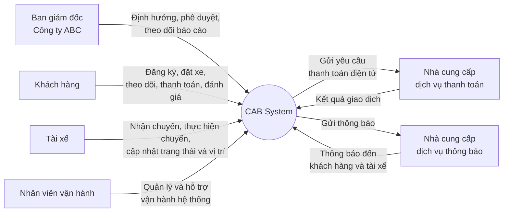
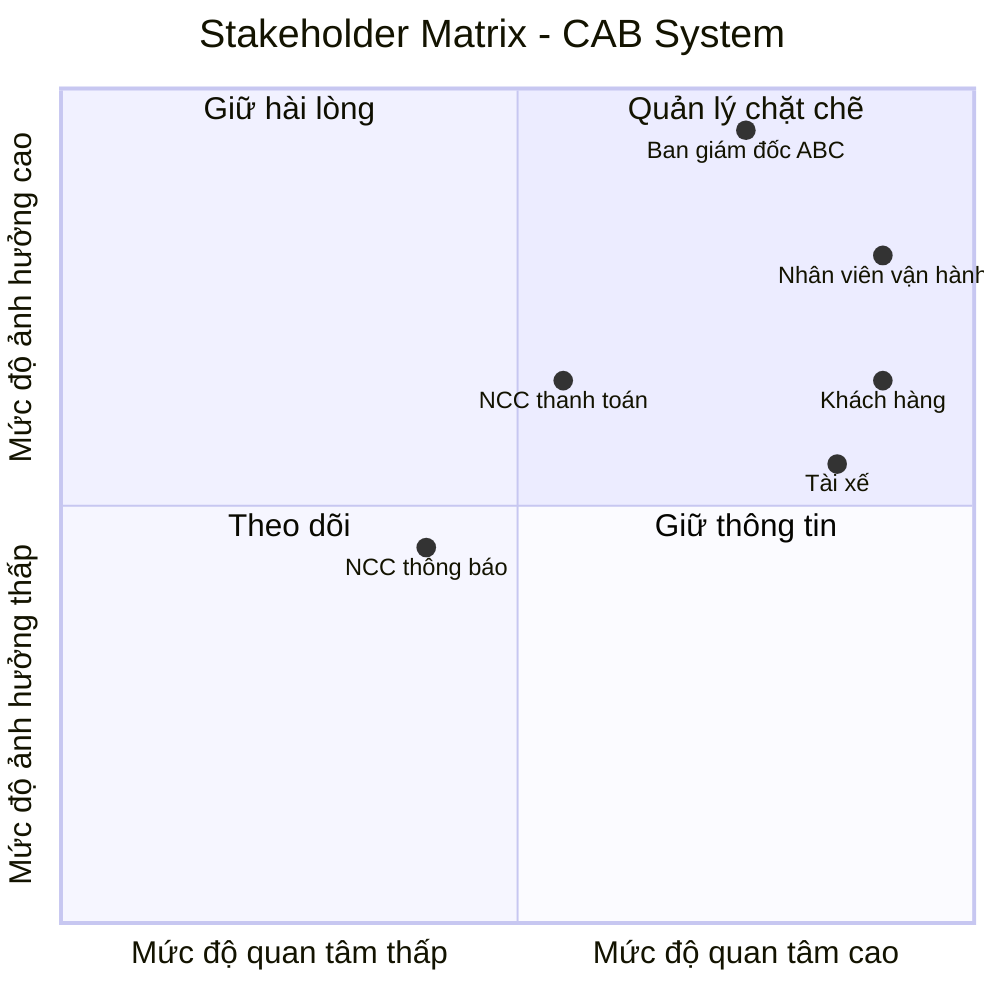
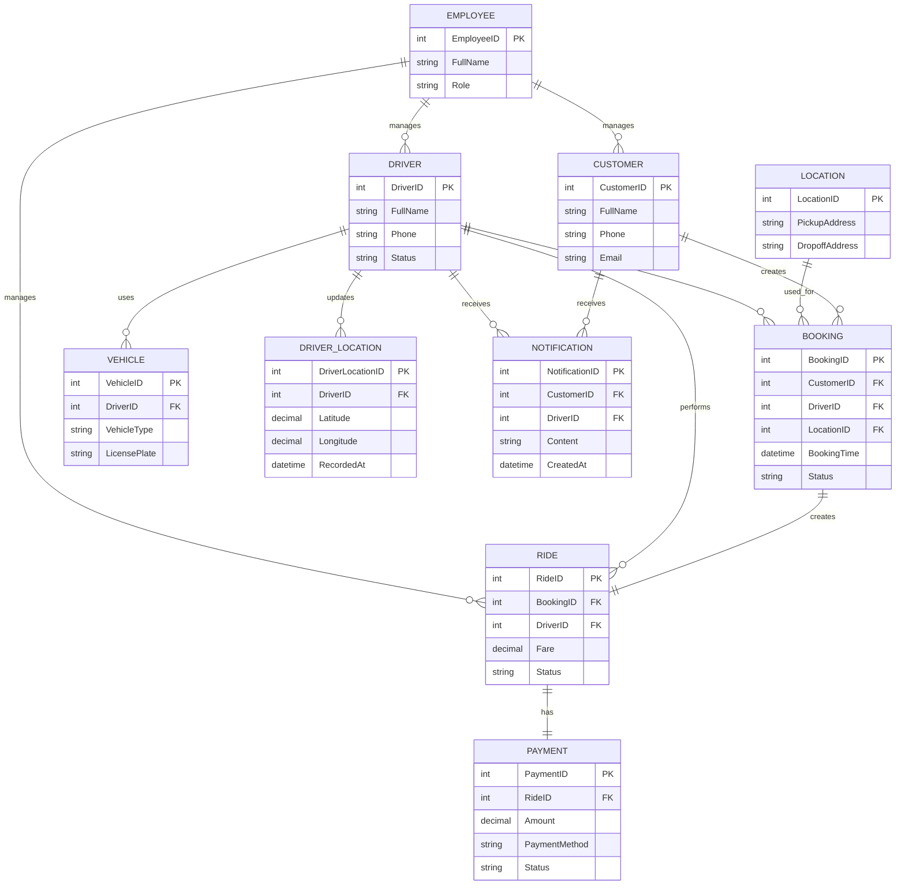

## 1. Tìm kiếm Stakeholders quan trọng

| Tên Stakeholder | Vai trò |
|---|---|
| Ban giám đốc Công ty ABC | Định hướng mục tiêu, phê duyệt yêu cầu và phạm vi hệ thống; theo dõi doanh thu, số lượng chuyến, tỷ lệ hoàn thành, tỷ lệ hủy và hiệu quả hoạt động. |
| Khách hàng | Sử dụng hệ thống để đăng ký, đặt xe, theo dõi chuyến đi, thanh toán, xem lịch sử và đánh giá tài xế. |
| Tài xế | Nhận và thực hiện chuyến đi; cập nhật trạng thái, vị trí, thông tin cá nhân và phương tiện. |
| Nhân viên vận hành | Quản lý khách hàng, tài xế, phương tiện và chuyến đi; theo dõi các chuyến đang diễn ra và hỗ trợ xử lý các trường hợp chuyến bị lỗi. |
| Nhà cung cấp dịch vụ thanh toán | Cung cấp dịch vụ thanh toán điện tử và xử lý các giao dịch thanh toán cho hệ thống CAB. |
| Nhà cung cấp dịch vụ thông báo | Cung cấp các kênh gửi thông báo đến khách hàng và tài xế về đặt xe, chuyến đi và thanh toán. |
## 2. Vẽ sơ đồ mermaid 

## 3. Stakeholder Matrix

## 4. Chuyển đổi yêu cầu khách hàng thành Business Goals (BG)

| Mã BG | Business Goal | Mô tả |
|---|---|---|
| BG01 | Nâng cao hiệu quả dịch vụ đặt xe | Xây dựng nền tảng CAB giúp tự động hóa quy trình từ đặt xe, tìm tài xế, thực hiện chuyến đến thanh toán và đánh giá. |
| BG02 | Rút ngắn thời gian phân công tài xế | Tự động tìm kiếm và ưu tiên tài xế phù hợp, gần khách hàng nhằm tăng tốc độ đáp ứng yêu cầu đặt xe. |
| BG03 | Nâng cao trải nghiệm khách hàng | Cung cấp thông tin minh bạch về tài xế, trạng thái chuyến đi, thời gian dự kiến, thanh toán và lịch sử chuyến. |
| BG04 | Tăng khả năng đáp ứng nhu cầu đặt xe | Đảm bảo hệ thống có khả năng tiếp tục tìm tài xế khác khi tài xế từ chối hoặc không phản hồi, đồng thời thông báo rõ ràng khi không tìm được tài xế. |
| BG05 | Tăng cường hiệu quả quản lý và vận hành | Cung cấp công cụ để nhân viên vận hành quản lý khách hàng, tài xế, phương tiện và chuyến đi, đồng thời hỗ trợ xử lý các trường hợp phát sinh. |
| BG06 | Quản lý tập trung hoạt động và giao dịch | Tập trung dữ liệu chuyến đi, thanh toán và lịch sử giao dịch để hỗ trợ theo dõi và quản lý hoạt động kinh doanh. |
| BG07 | Đảm bảo an toàn và bảo mật dữ liệu | Bảo vệ thông tin cá nhân, thông tin phương tiện, dữ liệu vị trí và dữ liệu giao dịch; kiểm soát quyền truy cập và lưu vết các thao tác quan trọng. |
| BG08 | Đảm bảo tính ổn định và liên tục của dịch vụ | Duy trì hoạt động của hệ thống khi nhu cầu tăng cao và hạn chế việc một thành phần gặp lỗi làm ảnh hưởng đến toàn bộ hệ thống. |
| BG09 | Hỗ trợ mở rộng quy mô kinh doanh | Xây dựng nền tảng có khả năng phục vụ số lượng lớn khách hàng và tài xế, đồng thời cho phép mở rộng các thành phần khi nhu cầu tăng. |
| BG10 | Tạo nền tảng linh hoạt cho phát triển trong tương lai | Cho phép bổ sung loại dịch vụ, phương thức thanh toán, nhà cung cấp thông báo và các chức năng mới mà không phải xây dựng lại toàn bộ hệ thống. |
| BG11 | Hỗ trợ ra quyết định kinh doanh | Cung cấp báo cáo về số lượng chuyến, doanh thu, tỷ lệ hoàn thành, tỷ lệ hủy và hiệu quả hoạt động của tài xế để ban lãnh đạo đánh giá và ra quyết định. |

## Giới hạn module
| Mã Module | Module | Business Goal liên quan |
|---|---|---|
| M01 | Quản lý khách hàng | BG03, BG06 |
| M02 | Quản lý tài xế | BG02, BG04 |
| M03 | Đặt xe và quản lý chuyến đi | BG01, BG02, BG03, BG04 |
| M04 | Quản lý cước và thanh toán | BG01, BG06 |
| M05 | Quản lý vận hành | BG05, BG06, BG08 |
---

## 5. Business Requirements (BR)

| Mã BR | Business Requirement | Business Goal liên quan | Module liên quan |
|---|---|---|---|
| BR01 | Hệ thống phải cung cấp nền tảng đặt xe giúp khách hàng thực hiện đầy đủ quy trình từ tạo yêu cầu đặt xe đến hoàn thành chuyến đi. | BG01 | M01, M03 |
| BR02 | Hệ thống phải tự động tìm kiếm và phân công tài xế phù hợp dựa trên vị trí, trạng thái hoạt động và các tiêu chí vận hành. | BG02 | M02, M03 |
| BR03 | Hệ thống phải cung cấp cho khách hàng thông tin về tài xế, trạng thái chuyến đi, thời gian dự kiến và thông tin thanh toán. | BG03 | M01, M03, M04 |
| BR04 | Hệ thống phải tiếp tục tìm kiếm tài xế khác khi tài xế từ chối hoặc không phản hồi và thông báo cho khách hàng khi không tìm được tài xế. | BG04 | M02, M03 |
| BR05 | Hệ thống phải hỗ trợ nhân viên vận hành quản lý khách hàng, tài xế, phương tiện và các chuyến đi. | BG05 | M01, M02, M05 |
| BR06 | Hệ thống phải tập trung và quản lý dữ liệu chuyến đi, thanh toán và lịch sử giao dịch để phục vụ hoạt động vận hành. | BG06 | M01, M04, M05 |
| BR07 | Hệ thống phải bảo vệ thông tin cá nhân, thông tin phương tiện, dữ liệu vị trí và dữ liệu giao dịch của người dùng. | BG07 | M01, M02, M04, M05 |
| BR08 | Hệ thống phải duy trì hoạt động ổn định khi nhu cầu sử dụng tăng cao và hạn chế ảnh hưởng đến chức năng đặt xe khi một thành phần gặp sự cố. | BG08 | M03, M04, M05 |
| BR09 | Hệ thống phải hỗ trợ mở rộng số lượng khách hàng, tài xế và các thành phần của hệ thống khi quy mô kinh doanh tăng. | BG09 | M01, M02, M03, M05 |
| BR10 | Hệ thống phải cho phép bổ sung loại dịch vụ, phương thức thanh toán và nhà cung cấp thông báo mới mà không phải xây dựng lại toàn bộ hệ thống. | BG10 | M03, M04, M05 |
| BR11 | Hệ thống phải cung cấp báo cáo về số lượng chuyến, doanh thu, tỷ lệ hoàn thành, tỷ lệ hủy và hiệu quả hoạt động của tài xế. | BG11 | M05 |

## 6. Mô hình hóa quy trình nghiệp vụ (BPM)

Dựa trên các Business Requirement (BR), hệ thống CAB được mô hình hóa thành các quy trình nghiệp vụ chính sau:

| Mã BPM | Quy trình nghiệp vụ | Business Requirement liên quan |
|---|---|---|
| BPM01 | Đặt xe và phân công tài xế | BR01, BR02, BR03, BR04 |
| BPM02 | Thực hiện và hoàn thành chuyến đi | BR01, BR03 |
| BPM03 | Tính cước và thanh toán | BR01, BR03, BR06 |
| BPM04 | Quản lý và hỗ trợ vận hành | BR05, BR06, BR07, BR08 |
| BPM05 | Báo cáo và theo dõi hoạt động | BR06, BR11 |
### BPM01 – Đặt xe và phân công tài xế

Mục đích: Cho phép khách hàng tạo yêu cầu đặt xe và hệ thống tìm kiếm, phân công tài xế phù hợp.

| STT | Actor | Hoạt động |
|---|---|---|
| 1 | Khách hàng | Nhập điểm đón, điểm đến và loại xe. |
| 2 | Khách hàng | Gửi yêu cầu đặt xe. |
| 3 | Hệ thống | Tiếp nhận và ghi nhận yêu cầu đặt xe. |
| 4 | Hệ thống | Tìm kiếm tài xế phù hợp dựa trên vị trí, trạng thái hoạt động và tiêu chí vận hành. |
| 5 | Hệ thống | Gửi yêu cầu chuyến đi đến tài xế phù hợp. |
| 6 | Tài xế | Tiếp nhận và phản hồi yêu cầu chuyến đi. |
| 7 | Hệ thống | Nếu tài xế chấp nhận, xác nhận phân công tài xế. |
| 8 | Hệ thống | Nếu tài xế từ chối hoặc không phản hồi, tiếp tục tìm tài xế khác. |
| 9 | Hệ thống | Thông báo thông tin tài xế cho khách hàng khi chuyến được phân công. |
| 10 | Hệ thống | Thông báo cho khách hàng nếu không tìm được tài xế phù hợp. |

### BPM02 – Thực hiện và hoàn thành chuyến đi

Mục đích: Quản lý quá trình tài xế thực hiện chuyến đi từ khi nhận chuyến đến khi hoàn thành.

| STT | Actor | Hoạt động |
|---|---|---|
| 1 | Tài xế | Nhận chuyến đã được phân công. |
| 2 | Tài xế | Di chuyển đến điểm đón. |
| 3 | Tài xế | Cập nhật trạng thái đã đến điểm đón. |
| 4 | Tài xế | Đón khách hàng. |
| 5 | Tài xế | Cập nhật trạng thái đã đón khách. |
| 6 | Tài xế | Thực hiện chuyến đi đến điểm đến. |
| 7 | Tài xế | Cập nhật trạng thái đang di chuyển. |
| 8 | Tài xế | Đến điểm đến. |
| 9 | Tài xế | Cập nhật trạng thái hoàn thành chuyến đi. |
| 10 | Hệ thống | Ghi nhận chuyến đi đã hoàn thành và cập nhật trạng thái chuyến. |

### BPM03 – Tính cước và thanh toán

Mục đích: Xác định số tiền khách hàng phải thanh toán và ghi nhận kết quả thanh toán sau khi chuyến đi hoàn thành.

| STT | Actor | Hoạt động |
|---|---|---|
| 1 | Hệ thống | Nhận thông tin chuyến đi đã hoàn thành. |
| 2 | Hệ thống | Xác định thông tin cần thiết để tính cước. |
| 3 | Hệ thống | Tính số tiền khách hàng phải thanh toán. |
| 4 | Hệ thống | Hiển thị số tiền phải thanh toán cho khách hàng. |
| 5 | Khách hàng | Lựa chọn phương thức thanh toán. |
| 6 | Khách hàng | Thực hiện thanh toán theo phương thức đã chọn. |
| 7 | Hệ thống | Nếu thanh toán tiền mặt, ghi nhận kết quả thanh toán. |
| 8 | Hệ thống | Nếu thanh toán điện tử, gửi yêu cầu đến nhà cung cấp dịch vụ thanh toán. |
| 9 | Nhà cung cấp dịch vụ thanh toán | Xử lý giao dịch và trả kết quả thanh toán. |
| 10 | Hệ thống | Ghi nhận kết quả giao dịch nếu thanh toán thành công. |
| 11 | Hệ thống | Thông báo thanh toán thất bại và cho phép khách hàng thực hiện lại theo chính sách nếu giao dịch không thành công. |

### BPM04 – Quản lý và hỗ trợ vận hành

Mục đích: Hỗ trợ nhân viên vận hành quản lý các đối tượng và xử lý các vấn đề phát sinh trong quá trình hoạt động của hệ thống.

| STT | Actor | Hoạt động |
|---|---|---|
| 1 | Nhân viên vận hành | Đăng nhập vào hệ thống. |
| 2 | Nhân viên vận hành | Theo dõi tình trạng hoạt động của hệ thống. |
| 3 | Nhân viên vận hành | Quản lý thông tin khách hàng. |
| 4 | Nhân viên vận hành | Quản lý thông tin tài xế và phương tiện. |
| 5 | Nhân viên vận hành | Theo dõi các chuyến đi đang diễn ra. |
| 6 | Nhân viên vận hành | Kiểm tra các trường hợp chuyến đi bị lỗi hoặc phát sinh vấn đề. |
| 7 | Nhân viên vận hành | Thực hiện xử lý vấn đề theo quy trình vận hành. |
| 8 | Hệ thống | Cập nhật và lưu kết quả xử lý. |
| 9 | Hệ thống | Ghi nhận các thao tác quản lý và xử lý quan trọng để phục vụ kiểm tra, truy vết. |

### BPM05 – Báo cáo và theo dõi hoạt động

Mục đích: Tổng hợp dữ liệu hoạt động để cung cấp thông tin cho ban giám đốc theo dõi và ra quyết định.

| STT | Actor | Hoạt động |
|---|---|---|
| 1 | Hệ thống | Thu thập dữ liệu chuyến đi. |
| 2 | Hệ thống | Thu thập dữ liệu thanh toán và doanh thu. |
| 3 | Hệ thống | Thu thập dữ liệu hoạt động của tài xế. |
| 4 | Hệ thống | Tổng hợp và xử lý dữ liệu. |
| 5 | Hệ thống | Tạo báo cáo hoạt động. |
| 6 | Ban giám đốc | Xem số lượng chuyến đi. |
| 7 | Ban giám đốc | Xem doanh thu. |
| 8 | Ban giám đốc | Xem tỷ lệ hoàn thành và tỷ lệ hủy chuyến. |
| 9 | Ban giám đốc | Xem hiệu quả hoạt động của tài xế. |
| 10 | Ban giám đốc | Sử dụng thông tin báo cáo để đánh giá và ra quyết định kinh doanh. |

### 7. System Requirements

| Mã SR     | System Requirement                                                                                                     |
| --------- | ---------------------------------------------------------------------------------------------------------------------- |
| **SR-01** | Hệ thống cho phép nhập và lưu điểm đón.                                                                                |
| **SR-02** | Hệ thống cho phép nhập và lưu điểm đến.                                                                                |
| **SR-03** | Hệ thống kiểm tra tính hợp lệ của điểm đón và điểm đến.                                                                |
| **SR-04** | Hệ thống tạo yêu cầu đặt xe và lưu trạng thái yêu cầu.                                                                 |
| **SR-05** | Hệ thống hiển thị danh sách tài xế được đề xuất.                                                                       |
| **SR-06** | Hệ thống cho phép khách hàng chọn tài xế.                                                                              |
| **SR-07** | Hệ thống cho phép khách hàng xác nhận tài xế đã chọn.                                                                  |
| **SR-08** | Hệ thống xác định tài xế đang trực tuyến và sẵn sàng nhận chuyến.                                                      |
| **SR-09** | Hệ thống nhận và cập nhật vị trí GPS của tài xế.                                                                       |
| **SR-10** | Hệ thống xác định tài xế phù hợp dựa trên khu vực và vị trí hiện tại.                                                  |
| **SR-11** | Hệ thống gửi yêu cầu chuyến xe đến tài xế phù hợp.                                                                     |
| **SR-12** | Hệ thống cho phép tài xế chấp nhận chuyến xe.                                                                          |
| **SR-13** | Hệ thống cho phép tài xế từ chối chuyến xe.                                                                            |
| **SR-14** | Hệ thống tự động xử lý trường hợp tài xế không phản hồi trong thời gian quy định.                                      |
| **SR-15** | Hệ thống tự động tìm tài xế khác khi chuyến xe bị từ chối hoặc hết thời gian phản hồi.                                 |
| **SR-16** | Hệ thống hiển thị trạng thái chuyến xe theo thời gian thực.                                                            |
| **SR-17** | Hệ thống cập nhật vị trí tài xế trong quá trình thực hiện chuyến xe.                                                   |
| **SR-18** | Hệ thống hiển thị vị trí tài xế trên bản đồ cho khách hàng.                                                            |
| **SR-19** | Hệ thống hiển thị thông tin tài xế, điểm đón và điểm đến của chuyến xe.                                                |
| **SR-20** | Hệ thống cho phép tài xế cập nhật trạng thái chuyến xe.                                                                |
| **SR-21** | Hệ thống kiểm tra tính hợp lệ khi chuyển đổi trạng thái chuyến xe.                                                     |
| **SR-22** | Hệ thống cho phép hủy chuyến xe theo điều kiện được quy định.                                                          |
| **SR-23** | Hệ thống tự động tính toán giá cước chuyến xe.                                                                         |
| **SR-24** | Hệ thống xác định và hiển thị số tiền khách hàng cần thanh toán.                                                       |
| **SR-25** | Hệ thống cho phép khách hàng lựa chọn phương thức thanh toán.                                                          |
| **SR-26** | Hệ thống tạo giao dịch thanh toán cho chuyến xe.                                                                       |
| **SR-27** | Hệ thống tiếp nhận kết quả xử lý thanh toán từ đơn vị cung cấp dịch vụ thanh toán.                                     |
| **SR-28** | Hệ thống lưu trạng thái giao dịch gồm PENDING, SUCCESS hoặc FAILED.                                                    |
| **SR-29** | Hệ thống không lưu trữ thông tin nhạy cảm của thẻ thanh toán.                                                          |
| **SR-30** | Hệ thống cho phép khách hàng xem lịch sử các chuyến xe.                                                                |
| **SR-31** | Hệ thống hiển thị thông tin chi tiết của từng chuyến xe trong lịch sử.                                                 |
| **SR-32** | Hệ thống hiển thị thông tin thanh toán tương ứng với chuyến xe.                                                        |
| **SR-33** | Hệ thống cho phép nhân viên vận hành quản lý thông tin khách hàng.                                                     |
| **SR-34** | Hệ thống cho phép nhân viên vận hành quản lý thông tin tài xế.                                                         |
| **SR-35** | Hệ thống cho phép nhân viên vận hành xem danh sách và chi tiết chuyến xe.                                              |
| **SR-36** | Hệ thống cho phép nhân viên vận hành theo dõi các chuyến xe đang hoạt động.                                            |
| **SR-37** | Hệ thống cung cấp số liệu tổng số chuyến xe.                                                                           |
| **SR-38** | Hệ thống cung cấp số liệu chuyến xe hoàn thành và bị hủy.                                                              |
| **SR-39** | Hệ thống cung cấp số liệu doanh thu.                                                                                   |
| **SR-40** | Hệ thống cho phép nhân viên vận hành xem thông tin giao dịch thanh toán.                                               |
| **SR-41** | Hệ thống ghi nhận lỗi khi dịch vụ thanh toán hoặc thông báo tạm thời không hoạt động.                                  |
| **SR-42** | Hệ thống đảm bảo không mất yêu cầu đặt xe khi dịch vụ bên thứ ba tạm thời bị gián đoạn.                                |
| **SR-43** | Hệ thống vẫn duy trì các chức năng đặt xe và quản lý chuyến xe khi dịch vụ thanh toán hoặc thông báo gặp lỗi tạm thời. |
| **SR-44** | Hệ thống cho phép thực hiện lại giao dịch thanh toán sau khi dịch vụ được khôi phục.                                   |

## 8. Business Rules

| Mã Rule     | Business Rule                                                                                            |
| ----------- | -------------------------------------------------------------------------------------------------------- |
| **RULE-01** | Khách hàng phải cung cấp đầy đủ điểm đón và điểm đến trước khi đặt xe.                                   |
| **RULE-02** | Điểm đón và điểm đến phải hợp lệ để hệ thống tạo yêu cầu đặt xe.                                         |
| **RULE-03** | Chỉ tài xế đang trực tuyến và sẵn sàng nhận chuyến mới được đưa vào danh sách tìm kiếm.                  |
| **RULE-04** | Tài xế được đề xuất phải phù hợp với vị trí và khu vực của chuyến xe.                                    |
| **RULE-05** | Một chuyến xe chỉ được xác nhận cho một tài xế tại một thời điểm.                                        |
| **RULE-06** | Tài xế phải phản hồi yêu cầu chuyến xe trong thời gian quy định.                                         |
| **RULE-07** | Khi tài xế từ chối hoặc không phản hồi, hệ thống phải tìm tài xế khác.                                   |
| **RULE-08** | Trạng thái chuyến xe phải được cập nhật theo đúng trình tự nghiệp vụ.                                    |
| **RULE-09** | Chỉ tài xế được phân công mới có quyền cập nhật trạng thái chuyến xe.                                    |
| **RULE-10** | Giá cước phải được hệ thống tự động tính dựa trên thông tin chuyến xe.                                   |
| **RULE-11** | Số tiền thanh toán phải tương ứng với giá cước của chuyến xe.                                            |
| **RULE-12** | Mỗi giao dịch thanh toán phải gắn với một chuyến xe cụ thể.                                              |
| **RULE-13** | Giao dịch thanh toán phải có trạng thái PENDING, SUCCESS hoặc FAILED.                                    |
| **RULE-14** | Không được lưu trữ thông tin nhạy cảm của thẻ thanh toán trên hệ thống.                                  |
| **RULE-15** | Khách hàng chỉ được xem lịch sử các chuyến xe thuộc tài khoản của mình.                                  |
| **RULE-16** | Nhân viên vận hành được quyền quản lý thông tin khách hàng, tài xế và chuyến xe theo quyền hạn được cấp. |
| **RULE-17** | Chỉ nhân viên vận hành có quyền xem và quản lý các chuyến xe đang hoạt động.                             |
| **RULE-18** | Doanh thu được tính dựa trên các giao dịch thanh toán hợp lệ.                                            |
| **RULE-19** | Khi dịch vụ thanh toán hoặc thông báo bị gián đoạn, hệ thống không được làm mất yêu cầu đặt xe.          |
| **RULE-20** | Các giao dịch thanh toán thất bại có thể được thực hiện lại khi dịch vụ thanh toán được khôi phục.       |

## 9. Nghiệp vụ phi chức năng

| Mã NFR     | Nghiệp vụ phi chức năng                                                                                          |
| ---------- | ---------------------------------------------------------------------------------------------------------------- |
| **NFR-01** | Hệ thống phải có thời gian phản hồi nhanh đối với các thao tác đặt xe, tìm tài xế và cập nhật trạng thái.        |
| **NFR-02** | Hệ thống phải hỗ trợ cập nhật vị trí tài xế gần như theo thời gian thực trong quá trình thực hiện chuyến xe.     |
| **NFR-03** | Hệ thống phải đảm bảo tính sẵn sàng của các chức năng đặt xe và quản lý chuyến xe.                               |
| **NFR-04** | Hệ thống phải đảm bảo dữ liệu yêu cầu đặt xe không bị mất khi dịch vụ bên thứ ba tạm thời gián đoạn.             |
| **NFR-05** | Hệ thống phải bảo vệ thông tin tài khoản và dữ liệu cá nhân của khách hàng, tài xế.                              |
| **NFR-06** | Hệ thống phải phân quyền truy cập phù hợp với từng nhóm người dùng.                                              |
| **NFR-07** | Hệ thống phải bảo mật thông tin và giao dịch thanh toán, không lưu trữ dữ liệu thẻ nhạy cảm.                     |
| **NFR-08** | Hệ thống phải đảm bảo tính toàn vẹn và nhất quán của dữ liệu chuyến xe và giao dịch.                             |
| **NFR-09** | Hệ thống phải có khả năng xử lý nhiều yêu cầu đặt xe đồng thời mà không làm gián đoạn hoạt động.                 |
| **NFR-10** | Hệ thống phải ghi nhận và lưu trữ nhật ký các lỗi và sự kiện quan trọng để phục vụ việc kiểm tra và xử lý sự cố. |
| **NFR-11** | Giao diện hệ thống phải dễ sử dụng, rõ ràng và phù hợp với thao tác trên máy tính và thiết bị di động.           |
| **NFR-12** | Hệ thống phải có khả năng mở rộng để đáp ứng số lượng khách hàng, tài xế và chuyến xe tăng trong tương lai.      |
| **NFR-13** | Hệ thống phải đảm bảo khả năng khôi phục dữ liệu và hoạt động sau khi xảy ra sự cố hệ thống.                     |
| **NFR-14** | Hệ thống phải tương thích với các trình duyệt web phổ biến.                                                      |
| **NFR-15** | Hệ thống phải duy trì hoạt động ổn định trong suốt thời gian cung cấp dịch vụ.                                   |

## 10. Xác định Entity và Mô hình thực thể kết hợp

### 10.1. Xác định các Entity

| Mã Entity | Entity          | Mô tả                                             |
| --------- | --------------- | ------------------------------------------------- |
| **E01**   | Customer        | Lưu thông tin khách hàng sử dụng dịch vụ đặt xe.  |
| **E02**   | Driver          | Lưu thông tin tài xế cung cấp dịch vụ vận chuyển. |
| **E03**   | Vehicle         | Lưu thông tin phương tiện của tài xế.             |
| **E04**   | Booking         | Lưu thông tin yêu cầu đặt xe của khách hàng.      |
| **E05**   | Ride            | Lưu thông tin chuyến xe được thực hiện.           |
| **E06**   | Location        | Lưu thông tin điểm đón và điểm đến.               |
| **E07**   | Payment         | Lưu thông tin giao dịch thanh toán.               |
| **E08**   | Driver_Location | Lưu vị trí GPS của tài xế.                        |
| **E09**   | Notification    | Lưu thông tin thông báo liên quan đến chuyến xe.  |
| **E10**   | Employee        | Lưu thông tin nhân viên vận hành hệ thống.        |

### 10.2. Mối quan hệ giữa các Entity

| Entity 1 | Quan hệ        | Entity 2        | Cardinality |
| -------- | -------------- | --------------- | ----------- |
| Customer | tạo            | Booking         | 1:N         |
| Booking  | sử dụng        | Location        | N:1         |
| Booking  | được phân công | Driver          | N:1         |
| Driver   | sở hữu/sử dụng | Vehicle         | 1:N         |
| Booking  | tạo thành      | Ride            | 1:1         |
| Driver   | thực hiện      | Ride            | 1:N         |
| Ride     | có             | Payment         | 1:1         |
| Driver   | cập nhật       | Driver_Location | 1:N         |
| Customer | nhận           | Notification    | 1:N         |
| Driver   | nhận           | Notification    | 1:N         |
| Employee | quản lý        | Customer        | 1:N         |
| Employee | quản lý        | Driver          | 1:N         |
| Employee | quản lý        | Ride            | 1:N         |

### 10.3. Mô hình thực thể kết hợp (ERD)

@startuml
left to right direction

actor Customer
actor Driver
actor Operator
actor Management
actor Accounting
actor "Payment Provider" as Payment
actor "Notification Provider" as Notification

rectangle "CAB System" {

  usecase "Đăng ký tài khoản" as UC01
  usecase "Đăng nhập" as UC02
  usecase "Đặt xe" as UC03
  usecase "Chọn điểm đón" as UC04
  usecase "Chọn điểm đến" as UC05
  usecase "Chọn loại xe" as UC06
  usecase "Tìm tài xế" as UC07
  usecase "Chọn tài xế" as UC08
  usecase "Xác nhận chuyến xe" as UC09
  usecase "Theo dõi chuyến xe" as UC10
  usecase "Thanh toán" as UC11
  usecase "Xem lịch sử chuyến xe" as UC12
  usecase "Hủy chuyến xe" as UC13

  usecase "Nhận yêu cầu chuyến xe" as UC14
  usecase "Chấp nhận chuyến xe" as UC15
  usecase "Từ chối chuyến xe" as UC16
  usecase "Cập nhật trạng thái chuyến xe" as UC17
  usecase "Cập nhật vị trí GPS" as UC18

  usecase "Quản lý khách hàng" as UC19
  usecase "Quản lý tài xế" as UC20
  usecase "Quản lý chuyến xe" as UC21
  usecase "Theo dõi chuyến xe đang hoạt động" as UC22
  usecase "Quản lý giao dịch" as UC23
  usecase "Xem báo cáo" as UC24
}

Customer --> UC01
Customer --> UC02
Customer --> UC03
Customer --> UC10
Customer --> UC11
Customer --> UC12
Customer --> UC13

UC03 .> UC04 : <<include>>
UC03 .> UC05 : <<include>>
UC03 .> UC06 : <<include>>
UC03 .> UC07 : <<include>>
UC03 .> UC08 : <<include>>
UC03 .> UC09 : <<include>>

Driver --> UC02
Driver --> UC14
Driver --> UC15
Driver --> UC16
Driver --> UC17
Driver --> UC18

Operator --> UC02
Operator --> UC19
Operator --> UC20
Operator --> UC21
Operator --> UC22
Operator --> UC23
Operator --> UC24

Management --> UC24
Accounting --> UC23
Accounting --> UC24

UC11 --> Payment
UC10 --> Notification
UC14 --> Notification

@enduml

## 11. Acceptance Criteria

### 11.1. Bảng tiêu chí chấp nhận

| Mã AC     | SR liên quan | Tiêu chí chấp nhận                                                                                                      |
| --------- | ------------ | ----------------------------------------------------------------------------------------------------------------------- |
| **AC-01** | SR-01        | Khi khách hàng nhập điểm đón hợp lệ, hệ thống phải lưu và hiển thị chính xác điểm đón.                                  |
| **AC-02** | SR-02        | Khi khách hàng nhập điểm đến hợp lệ, hệ thống phải lưu và hiển thị chính xác điểm đến.                                  |
| **AC-03** | SR-03        | Khi điểm đón hoặc điểm đến không hợp lệ, hệ thống phải thông báo lỗi và không tạo yêu cầu đặt xe.                       |
| **AC-04** | SR-04        | Khi thông tin đặt xe hợp lệ, hệ thống phải tạo booking và gán trạng thái ban đầu cho booking.                           |
| **AC-05** | SR-05        | Hệ thống phải hiển thị danh sách các tài xế phù hợp với yêu cầu đặt xe.                                                 |
| **AC-06** | SR-06        | Khách hàng phải có thể chọn một tài xế từ danh sách được đề xuất.                                                       |
| **AC-07** | SR-07        | Sau khi khách hàng xác nhận, hệ thống phải lưu tài xế được chọn cho booking.                                            |
| **AC-08** | SR-08        | Chỉ tài xế có trạng thái trực tuyến và sẵn sàng mới được hệ thống xem xét để nhận chuyến.                               |
| **AC-09** | SR-09        | Khi tài xế thay đổi vị trí, hệ thống phải nhận và cập nhật tọa độ GPS mới.                                              |
| **AC-10** | SR-10        | Hệ thống phải lựa chọn tài xế dựa trên vị trí và trạng thái sẵn sàng.                                                   |
| **AC-11** | SR-11        | Hệ thống phải gửi yêu cầu chuyến xe đến tài xế được lựa chọn/phù hợp.                                                   |
| **AC-12** | SR-12        | Khi tài xế chấp nhận, trạng thái yêu cầu phải được cập nhật thành đã chấp nhận/xác nhận theo quy trình.                 |
| **AC-13** | SR-13        | Khi tài xế từ chối, hệ thống phải ghi nhận việc từ chối và xử lý tìm tài xế khác.                                       |
| **AC-14** | SR-14        | Nếu tài xế không phản hồi trong thời gian quy định, hệ thống phải tự động xử lý yêu cầu hết thời gian.                  |
| **AC-15** | SR-15        | Khi tài xế từ chối hoặc hết thời gian phản hồi, hệ thống phải thực hiện lại quá trình tìm tài xế theo quy định.         |
| **AC-16** | SR-16        | Khách hàng phải nhìn thấy trạng thái hiện tại của chuyến xe và trạng thái phải được cập nhật khi có thay đổi.           |
| **AC-17** | SR-17        | Trong quá trình chuyến xe diễn ra, vị trí tài xế phải được cập nhật trên hệ thống.                                      |
| **AC-18** | SR-18        | Khách hàng phải có thể xem vị trí hiện tại của tài xế trên bản đồ.                                                      |
| **AC-19** | SR-19        | Hệ thống phải hiển thị đúng thông tin tài xế, điểm đón và điểm đến của chuyến xe.                                       |
| **AC-20** | SR-20        | Tài xế phải có thể cập nhật trạng thái chuyến xe theo các trạng thái được hệ thống cho phép.                            |
| **AC-21** | SR-21        | Khi tài xế thực hiện chuyển trạng thái không hợp lệ, hệ thống phải từ chối thao tác và thông báo lỗi.                   |
| **AC-22** | SR-22        | Khi khách hàng hủy chuyến trong điều kiện cho phép, hệ thống phải cập nhật chuyến xe thành trạng thái đã hủy.           |
| **AC-23** | SR-23        | Với cùng một thông tin chuyến xe, hệ thống phải tính giá cước theo công thức được quy định và trả về kết quả.           |
| **AC-24** | SR-24        | Hệ thống phải hiển thị số tiền khách hàng cần thanh toán và số tiền phải khớp với giá cước của chuyến xe.               |
| **AC-25** | SR-25        | Khách hàng phải có thể lựa chọn một phương thức thanh toán hợp lệ.                                                      |
| **AC-26** | SR-26        | Khi thực hiện thanh toán, hệ thống phải tạo một giao dịch gắn với đúng chuyến xe.                                       |
| **AC-27** | SR-27        | Hệ thống phải tiếp nhận và xử lý được kết quả thanh toán từ Payment Provider.                                           |
| **AC-28** | SR-28        | Hệ thống phải lưu đúng một trong các trạng thái PENDING, SUCCESS hoặc FAILED cho giao dịch.                             |
| **AC-29** | SR-29        | Kiểm tra dữ liệu lưu trữ phải đảm bảo hệ thống không lưu thông tin thẻ nhạy cảm.                                        |
| **AC-30** | SR-30        | Khách hàng phải có thể xem danh sách các chuyến xe thuộc tài khoản của mình.                                            |
| **AC-31** | SR-31        | Chi tiết chuyến xe phải hiển thị đầy đủ các thông tin được quy định.                                                    |
| **AC-32** | SR-32        | Thông tin thanh toán hiển thị phải tương ứng với đúng chuyến xe.                                                        |
| **AC-33** | SR-33        | Nhân viên vận hành phải có thể xem, thêm, sửa hoặc quản lý thông tin khách hàng theo quyền được cấp.                    |
| **AC-34** | SR-34        | Nhân viên vận hành phải có thể xem và quản lý thông tin tài xế theo quyền được cấp.                                     |
| **AC-35** | SR-35        | Nhân viên vận hành phải có thể xem danh sách và chi tiết các chuyến xe.                                                 |
| **AC-36** | SR-36        | Hệ thống phải hiển thị danh sách các chuyến xe đang hoạt động để nhân viên vận hành theo dõi.                           |
| **AC-37** | SR-37        | Báo cáo phải hiển thị được tổng số chuyến xe trong khoảng thời gian được chọn.                                          |
| **AC-38** | SR-38        | Báo cáo phải phân biệt được số chuyến hoàn thành và số chuyến bị hủy.                                                   |
| **AC-39** | SR-39        | Báo cáo doanh thu phải được tính từ các giao dịch thanh toán hợp lệ.                                                    |
| **AC-40** | SR-40        | Nhân viên vận hành phải có thể xem thông tin các giao dịch thanh toán.                                                  |
| **AC-41** | SR-41        | Khi Payment Provider hoặc Notification Provider bị lỗi, hệ thống phải ghi nhận sự cố vào log.                           |
| **AC-42** | SR-42        | Khi dịch vụ bên thứ ba tạm thời không hoạt động, yêu cầu đặt xe đã tạo phải vẫn được lưu trên hệ thống.                 |
| **AC-43** | SR-43        | Khi dịch vụ thanh toán hoặc thông báo bị gián đoạn, các chức năng đặt xe và quản lý chuyến xe chính vẫn phải hoạt động. |
| **AC-44** | SR-44        | Sau khi dịch vụ thanh toán được khôi phục, hệ thống phải cho phép thực hiện lại giao dịch FAILED/PENDING theo quy định. |

### 11.2. Nguyên tắc xác nhận

Một **SR được xem là đạt** khi tất cả các **AC liên quan** đến SR đó đều đạt.

* **PASS:** Tất cả tiêu chí AC của SR đều thỏa mãn.
* **FAIL:** Có ít nhất một tiêu chí AC không thỏa mãn.
* Mỗi AC phải có kết quả kiểm thử rõ ràng để xác định yêu cầu có đạt hay không.

## 12. Bảng truy vết yêu cầu

Bảng truy vết được sử dụng để kiểm soát mối liên hệ giữa mục tiêu nghiệp vụ, yêu cầu nghiệp vụ, mô hình quy trình nghiệp vụ, yêu cầu hệ thống, Use Case và tiêu chí chấp nhận.

Chuỗi truy vết của hệ thống:

**BG → BR → PBM → SR → UC → AC**

Trong đó:

* **BG (Business Goal):** Mục tiêu nghiệp vụ.
* **BR (Business Requirement):** Yêu cầu nghiệp vụ.
* **PBM (Process Business Model):** Mô hình quy trình nghiệp vụ.
* **SR (System Requirement):** Yêu cầu hệ thống.
* **UC (Use Case):** Chức năng/ca sử dụng của hệ thống.
* **AC (Acceptance Criteria):** Tiêu chí chấp nhận dùng để xác định yêu cầu đã đạt hay chưa.

### 12.1. Traceability Matrix

| BG    | BR    | PBM    | SR    | UC    | AC                        |
| ----- | ----- | ------ | ----- | ----- | ------------------------- |
| BG-01 | BR-01 | PBM-01 | SR-01 | UC-03 | AC-01.1, AC-01.2          |
| BG-01 | BR-01 | PBM-01 | SR-02 | UC-03 | AC-02.1, AC-02.2          |
| BG-01 | BR-01 | PBM-01 | SR-03 | UC-03 | AC-03.1, AC-03.2, AC-03.3 |
| BG-01 | BR-01 | PBM-01 | SR-04 | UC-03 | AC-04.1, AC-04.2          |
| BG-02 | BR-02 | PBM-02 | SR-05 | UC-03 | AC-05.1, AC-05.2          |
| BG-02 | BR-02 | PBM-02 | SR-06 | UC-05 | AC-06.1, AC-06.2          |
| BG-02 | BR-02 | PBM-02 | SR-07 | UC-06 | AC-07.1, AC-07.2          |
| BG-03 | BR-03 | PBM-03 | SR-08 | UC-07 | AC-08.1                   |
| BG-03 | BR-03 | PBM-03 | SR-09 | UC-17 | AC-09.1, AC-09.2          |
| BG-03 | BR-03 | PBM-03 | SR-10 | UC-07 | AC-10.1, AC-10.2          |
| BG-03 | BR-03 | PBM-03 | SR-11 | UC-07 | AC-11.1                   |
| BG-04 | BR-04 | PBM-04 | SR-12 | UC-14 | AC-12.1                   |
| BG-04 | BR-04 | PBM-04 | SR-13 | UC-15 | AC-13.1                   |
| BG-04 | BR-04 | PBM-04 | SR-14 | UC-14 | AC-14.1                   |
| BG-04 | BR-04 | PBM-04 | SR-15 | UC-07 | AC-15.1, AC-15.2          |
| BG-05 | BR-05 | PBM-05 | SR-16 | UC-10 | AC-16.1, AC-16.2          |
| BG-05 | BR-05 | PBM-05 | SR-17 | UC-17 | AC-17.1                   |
| BG-05 | BR-05 | PBM-05 | SR-18 | UC-10 | AC-18.1, AC-18.2          |
| BG-05 | BR-05 | PBM-05 | SR-19 | UC-10 | AC-19.1                   |
| BG-06 | BR-06 | PBM-06 | SR-20 | UC-16 | AC-20.1, AC-20.2          |
| BG-06 | BR-06 | PBM-06 | SR-21 | UC-16 | AC-21.1                   |
| BG-06 | BR-06 | PBM-06 | SR-22 | UC-13 | AC-22.1, AC-22.2          |
| BG-07 | BR-07 | PBM-07 | SR-23 | UC-03 | AC-23.1, AC-23.2          |
| BG-07 | BR-07 | PBM-07 | SR-24 | UC-03 | AC-24.1                   |
| BG-08 | BR-08 | PBM-08 | SR-25 | UC-11 | AC-25.1                   |
| BG-08 | BR-08 | PBM-08 | SR-26 | UC-11 | AC-26.1, AC-26.2          |
| BG-08 | BR-08 | PBM-08 | SR-27 | UC-11 | AC-27.1                   |
| BG-08 | BR-08 | PBM-08 | SR-28 | UC-11 | AC-28.1, AC-28.2          |
| BG-08 | BR-08 | PBM-08 | SR-29 | UC-11 | AC-29.1                   |
| BG-09 | BR-09 | PBM-09 | SR-30 | UC-12 | AC-30.1                   |
| BG-09 | BR-09 | PBM-09 | SR-31 | UC-12 | AC-31.1, AC-31.2          |
| BG-09 | BR-09 | PBM-09 | SR-32 | UC-12 | AC-32.1                   |
| BG-10 | BR-10 | PBM-10 | SR-33 | UC-19 | AC-33.1                   |
| BG-10 | BR-10 | PBM-10 | SR-34 | UC-20 | AC-34.1                   |
| BG-10 | BR-10 | PBM-10 | SR-35 | UC-21 | AC-35.1                   |
| BG-10 | BR-10 | PBM-10 | SR-36 | UC-22 | AC-36.1                   |
| BG-11 | BR-11 | PBM-11 | SR-37 | UC-24 | AC-37.1                   |
| BG-11 | BR-11 | PBM-11 | SR-38 | UC-24 | AC-38.1                   |
| BG-11 | BR-11 | PBM-11 | SR-39 | UC-24 | AC-39.1                   |
| BG-11 | BR-11 | PBM-11 | SR-40 | UC-23 | AC-40.1                   |
| BG-12 | BR-12 | PBM-12 | SR-41 | UC-21 | AC-41.1                   |
| BG-12 | BR-12 | PBM-12 | SR-42 | UC-03 | AC-42.1                   |
| BG-12 | BR-12 | PBM-12 | SR-43 | UC-03 | AC-43.1                   |
| BG-12 | BR-12 | PBM-12 | SR-44 | UC-11 | AC-44.1                   |

bữa sau đặc tả API. Đặc tả từ SR. Mối SR là một API. 
